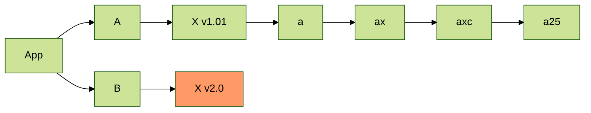

# gugu

一款简单的博客框架，基于 Vue3、Vite、Tailwind CSS、TypeScript，简单，支持 SSR、SSG。

## 项目结构要求

```bash
.
├── README.md
├── source
│   ├── customRuntime # 可以添加自定义的 ts、tsx、less、css 文件，会被运行时引入
│   ├── drafts # 草稿目录，markdown 文件
│   ├── pages # 自定义页面，markdown 文件
│   ├── posts # 文章目录，markdown 文件
│   └── CNAME、favicon.ico... # 其他任意，最终会被直接拷贝
└── .gugurc.yml # 配置文件
```

`.gugurc.yml` 配置详见：[daief 的配置文件](../../.gugurc.yml)。

- `customRuntime` 用于存放自定义的运行时脚本
- `pages` 中的文件会按照文件路径解析成页面，如有 `pages/about.md` 文件，最终的访问地址为 `https://example.com/about`
- `posts` 下存放博客文章，每篇需要一个独立的 `id`，最终的访问地址为 `https://example.com/post/:id`

需要注意的点：

- 更改配置文件、在 customRuntime 中增删文件都需要重启服务
- 版本要求：`node>=12.20.0`

## gugu 支持的命令

启动本地服务：

```bash
$ gugu dev
```

构建生产环境的资源：

```bash
$ gugu build
```

以 SSR 模式运行（需要先执行 build）：

```bash
$ gug serve
```

SSG 构建静态 HTML（需要先执行 build），这一步会产出构建结果，默认输出在 `dist` 目录，其中的内容支持纯静态的方式部署：

```bash
$ gug generate
```

## 支持的特性

### 写作

#### 基本格式

Markdown 支持以下配置：

```md
--- # 文档配置由 --- 开始
title: 文章的标题
# 创建时间
date: 2021-07-25 22:18:00
# 文章的 id
id: a-post-id
# 分类
categories: ['分类1', '分类2']
# 标签
tags:
  - tag1
  - tag2
# SEO 关键字
keywords:
# SEO 描述
description:
# 自定义排序值，默认为 0，大于 0 会被认为是置顶
sort: 0
# 是否开启评论，默认开启
comments: false
# 文档配置以 --- 结束
---

文章前言，会在列表中展示。

<!-- more -->

more 注释下文的是正文内容。
```

#### 支持 mermaid

````md

````

#### 图片

相对路径引用的图片会被自动包含：

```md

```

图片支持设置属性：

```md


同时设置图片 `title`：


```
