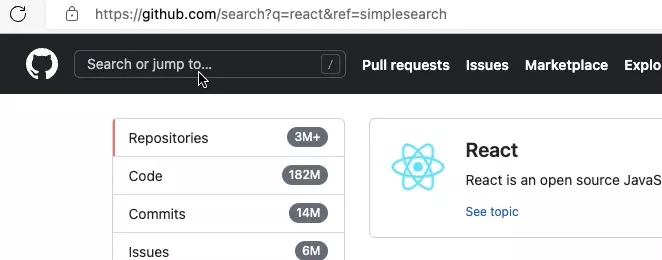
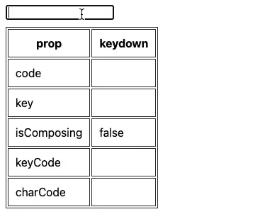

输入、回车提交，这是一组在搜索场景中常见、友好的交互形式，但要将其做好以获得更好的用户体验，还需要关注其中的小小细节。

<!-- more -->

## 监听回车

所谓的细节就是关于“回车”的监听。因为输入法的存在，引入了文本合成现象，使得字符输入变得不再纯粹简单。

若处理不当，就会出现在开着输入法的情况下，当只想使用回车输入字符时，却触发了提交动作。

就像这样：



大胆猜想一下，上面输入框的实现可能是这样的：

```ts
input.addEventListener('keydown', (e) => {
  if (e.code !== 'Enter') return;
  // ... submit
});
```

问题的原因就很明显了，需要在判断回车的时候，考虑一下用户的输入模式。那么问题来了，如何区分用户是否处于输入法模式呢，又或者说是处于文本合成事件当中？

回到 `keydown` 事件，探究 KeyboardEvent 对象上的几个属性：

- charCode：已废弃，Edge 106.0.1370.47 上读取的值总是 0
- code：表示键盘上的物理键，该值不会被键盘布局或修饰键的状态改变，例如有 ShiftLeft、Digit3、KeyD
- key：用户按下的物理按键的值，与 `shiftKey` 等调节性按键的状态和键盘的区域 / 和布局有关，例如有 D、d、shift、3、#
- keyCode：已废弃，Edge 106.0.1370.47 上还能使用
- isComposing：表示事件是否处于文本合成事件之间



有了上述信息，结合 `isComposing` 就能很容易地判断出是否处于输入法模式了：

```ts
input.addEventListener('keydown', (e) => {
  if (!e.isComposing && e.code === 'Enter') {
    // ... submit
  }
});
```

如此一来，搜索场景的用户体验就能做到完善了。

## 关于废弃的 keyCode

keyCode 虽然被标记为废弃、原则上不应再去用，但依旧有在被使用（比如别人写的代码），所以需要具备一些相关的知识。

简单来说，keyCode 是键盘字符映射的一个数字值，而 keyCode 被废弃的原因大概是某些键的映射值表现不一吧，比如在不同浏览器上会有值不同的情况。

另外，keyCode 还有一个魔法值：`229`，表示正处于文本合成事件当中。

## 文本合成事件

浏览器有专门的文本合成事件用于监听，即：

- compositionstart
- compositionupdate
- compositionend

通过该事件可获取处于合成事件中的文本，即输入法正在键入的字符：

```ts
input.addEventListener('compositionupdate', (event) => {
  console.log(`characters: ${event.data}`);
});
```

## 结语

简单介绍了与输入法相关的一些事件使用，简单的事情背后也有他的细节，做好了细节才能将一件事做到尽善尽美。

相关资料：

- [Element: 键盘按下事件](https://developer.mozilla.org/zh-CN/docs/Web/API/Element/keydown_event)
- [KeyboardEvent](https://developer.mozilla.org/zh-CN/docs/Web/API/KeyboardEvent)
