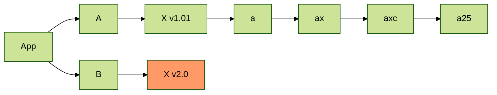

1111222 这里是概览、前言，这里是概览、前言，这里是概览、前言，这里是概览、前言，这里是概览、前言，这里是概览、前言，这里是概览、前言，这里是概览、前言，这里是概览、前言，这里是概览、前言，这里是概览、前言，这里是概览、前言。

<!-- more -->

这里是正文这里是正文这里是正文这里是正文这里是正文这里是正文这里是正文。

测试绘图：



测试图片：

网络：


本地：


```ts
interface Type {
  name?: string;
  id: string;
}

const a: Type = {
  name: 'name-name',
  id: 'id',
};
```

# 测试标题 1

传说中统治了不列颠的骑士王，亚瑟王。
作为国王君临天下之后，主武装由圣剑改为圣枪的亚瑟王。

## 测试标题 1-1

不再受到圣剑导致的成长停止的影响，于是肉体年龄成长到了与王的身份相切合的阶段。
因使用了圣枪而成为接近神灵的存在，但由于使用时间仅为十年左右，所以精神构造·灵子构造并未有大幅变化。
作为 Lancer 时的体重或者体型存在诸多说法。
同时，作为 Lancer 时，必将乘在马上。本次的坐骑是名马「东・斯塔利恩」。

### 测试标题 1-1-1

统治了不列颠的传说之骑士王、亚瑟王。
是作为王扩张势力后，作为主要武装采用了圣枪而非圣剑统治了不列颠的亚瑟王的 if。
没有了圣剑带来的成长停止，成长到了和王的身份相符的肉体年龄。

## 测试标题 1-2

因为使用圣枪而成为了接近神灵的存在，但因为使用时间只有十年左右所以精神构造·灵子构造没有太大变化。 [1]
作为 Lancer 时的体重或者体型存在诸多说法。
同时，作为 Lancer 时，必将乘在马上。本次的坐骑是「东·斯塔利恩」。 [2]
她是由通常的阿尔托莉雅「不同的可能性」诞生的英灵。

# 测试标题 2

虽然还具有人类的身形，但已经几乎无法称之为人的英灵。
因为蕴藏在圣枪中的特性，她的变化·性质已经变化为了神灵，可勉强称之为接近女神的存在。
虽然比圣剑的阿尔托莉雅要变得合理、冷静得多，但没有失去人性。
应该说因为成长为了大人，在她的选择上多了份从容，作为王的存在形式非常理想。

## 测试标题 2-1

这个她是在卡姆兰之丘亲自夺回了圣枪，回归了大地的天之英灵。
但是和她具有相同外貌的神灵「狮子王」在应当迎接死亡之时未能死去，结果成为了手持圣枪彷徨于世的亡灵。
一直手持圣枪的「狮子王」因为彻底化身为了神灵，所以和这个她内心上有不同。 [1]
作为 Servant 召唤到迦勒底的她，了解世界的美好。

## 测试标题 2-2

其真实姿态据说是系住世界表皮的塔。在真名解放时等级和种类会发生变化。 [1]
纵使被十三拘束限制了其本来的力量，也将歌颂星辰之光而闪烁的至远之枪———
圣枪伦戈米尼亚德将维系世界表层的「光之柱」为本体。由于和「拯救世界的星之圣剑」具有同等程序的十三拘束存在，处于勉强维持作为宝具身形的状态。 [1]
