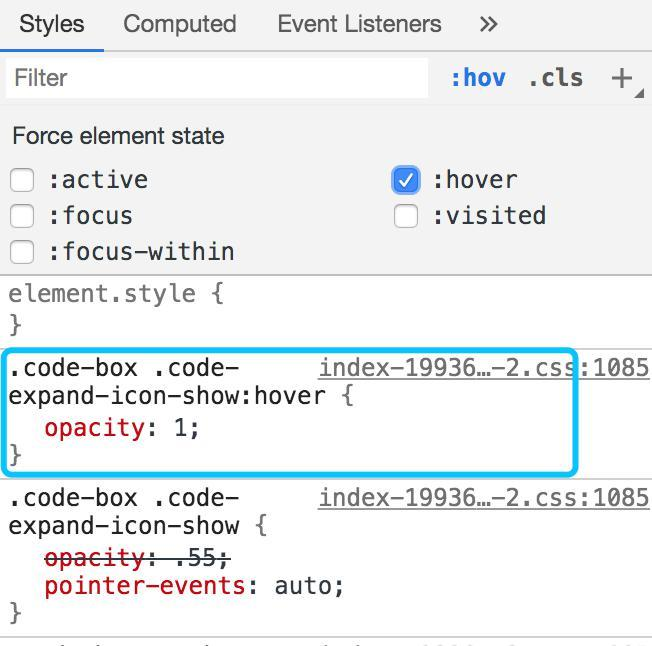

记录那些年，我们都在用的调试方法。第一部分主要是一些 Chrome 开发者工具的使用记录；剩余部分是一些其他的调试手段，包括移动端调试、代理内容的介绍。了解 Chrome 开发者的同学，可以跳过第一部分。


<!-- more -->

# Chrome 开发者工具

Chrome 开发者工具（DevTools）所提供的功能十分强大，对我而言已经是 Web 开发中不可缺少的部分了。Chrome DevTools 的功能很丰富，值得我们尽情探索。

温馨提示：可使用 `Command` + `F` 搜索 `Tips` 在本页查看一些技巧，大概。

|            | 参数                                      |
| ---------- | ----------------------------------------- |
| Google     | Chrome 76.0.3809.132 (正式版本) （64 位） |
| 操作系统   | Mac OS X                                  |
| JavaScript | V8 7.6.303.29                             |

## 打开 DevTools

- 在页面上`右键`，选择`检查`
- 在 Chrome 菜单中选择 `更多工具` > `开发者工具`
- 快捷键方式呼出，应该是最常用的
  - Mac：`Command` + `Option` + `I`
  - Windows：`Ctrl` + `Shift` + `I`
  - `F12`


之后，就可以看如图所示的 DevTools 面板，接下来的工作都将在这上面进行。

接下来，开始从我所了解的面板开始，展开实际使用的阐述。需要说明的是，每一块的内容实际很多，但我只会作个大体的概括，写一些我所认为可能较为常用的或是有趣的部分；还有一些内容只要点击试试就能明白，也希望大家能够多多实践。

而且即便列出所有的点，实际上只是官方文档的复制粘贴而已，[详细的内容推荐直接在官方文档上进行查阅](https://developers.google.com/web/tools/chrome-devtools)。

## 设备模式

该部分相关文档：<https://developers.google.com/web/tools/chrome-devtools/device-mode/>

点亮如图按钮即可进入设备模式。设备模式对于开发移动端页面时十分有帮助，在该模式下，可方便地查看页面在各种尺寸设备上的表现。


当预设的型号不满足要求时，还可以自定义添加新的设备，设置宽高，**同时支持设置 userAgent 的值**，这让我们可以轻松模拟出一些特定环境的设置，如通过 UA 简单模拟微信。

此处可限制设备的网速和 CPU 使用率，如只想单独限制网速，可在网络面板（Network）中设置。


右上角更多菜单（三个点）中还有一些快捷功能，比如开启显示标尺、显示媒体查询、页面截图等功能。

## 元素面板（Elements）

该部分相关文档：<https://developers.google.com/web/tools/chrome-devtools/dom>

> 使用元素面板可以自由的操作 DOM 和 CSS 来迭代布局和设计页面。

选中对应元素的 DOM：

- 使用左上角按钮（快捷键：`Command` + `Option` + `C`）
- 在页面上元素右键 => 检查


在 DOM 树区域，支持直接拖拉节点、复制粘贴大法（`Ctrl` + `C`、`V`）、编辑节点、编辑属性等等。

> Tips：选中节点后，敲击键盘 `H` 可快速切换元素的显隐状态。

选中节点后右键：

- Copy JS path。得到形如 `document.querySelector("#components-select-demo-basic")` 的结果
- Copy styles。得到该元素计算过后的 CSS 样式。
- Break on。可设置 DOM 断点，监听子元素被`移除`或者`添加`的事件、选中的节点被`添加`，`移除`或者`被修改值`的事件、监听被选中的元素被`移除`的事件。

在 CSS 区域中会按照权重高低列出所有元素命中的样式，还可以通过如下方式查看元素伪类的样式。



可以直接在在此编辑样式，并能实时反馈在页面当中，有助于调整。同时，对于颜色、阴影、贝塞尔曲线等参数，还提供了强大的 GUI 以供使用。

例：点击颜色前的方块，即可打开 Color Picker。


页面复杂时，此处的展示的样式会比较多，难以知晓具体生效的样式。一是通过前文提及的 `Copy styles` 获取样式，二则可以切换子 tab 到 `computed`，此处可以清晰看到最终计算后所生效的样式内容。

> Tips:
> 形如一些 tooltip 的元素（指只在鼠标移上时才会出现，而设置伪类 hover 却不能使之显现）该如何选中？
>
> - 先移上鼠标让 tooltip 出现，按下快捷键 `Command` + `Shift` + `C` 进行选取。
> - 方法一并不总是奏效，第二种依旧先让元素出现，再使用快捷键 `F8` 暂停脚本，最后可随意进行选择。（暂停按钮位于 Source 面板）

## 控制台面板（Console）

在这里，可以查看日志，执行代码。看似简短的一句话，但却远远不止如此。


该部分相关文档：<https://developers.google.com/web/tools/chrome-devtools/console>。

### console 系列

console API：<https://developers.google.com/web/tools/chrome-devtools/console/api>。

API 系列就不再啰嗦，就说一些其他的。

> Tips：
>
> - console 打印的是对象引用，所以通过引用，可以更改引用所指向的对象的值、或是调用一些方法。
> - 对控制台输出的对象右键，选择 `Store as global variable` 可获得该对象的全局引用，从而方便地进行相应操作。
>
> - 使用 console 作为回调
>
> ```js
> fetch(url)
>   .then((r) => r.json())
>   .then(console.log);
> ```
>
> - lambda 中添加 log
>
> ```js
> // 如下代码，查看 r 的值
> fetch(url).then((r) => r.json());
> // 添加 log
> fetch(url).then((r) => console.log(r) || r.json());
> ```
>
> - 控制台中可直接使用 `await`
>
> ```js
> const response = await fetch(url);
> const json = await response.json();
> console.log(json);
> ```

### 工具类 API （Utilities API）

DevTools 还提供了很多高效的工具类函数，下面挑几个进行~~介绍~~（翻译 🤪）。

该部分相关文档：<https://developers.google.com/web/tools/chrome-devtools/console/utilities>。

`$_` 指向控制台中最后一个表达式的结果。

`$0`、`$1`、`$2`、`$3`、`$4` 依次指向最近历史中被选择过的 DOM 元素。

`$(selector)` 可像 `jQuery` 一样选择元素，是 `document.querySelector` 的别名。

`$$(selector)` 执行 `document.querySelectorAll`，但结果是真正的数组类型，而不是一个 Node list。

`dir`。当在控制台输出 `$0` 时，我们看到的是一个 DOM 对象，无法点开查看属性，而使用 `dir($0)` 就能清晰地看到对象属性，同时 `dir` 是 `console.dir` 的别名。


点击眼睛图标可创建“活”的表达式（Live Expressions），表达式的值会根据变化而变化，多次点击可创建多条表达式。


## 网络面板（Network）

该部分相关文档：<https://developers.google.com/web/tools/chrome-devtools/network?hl=zh-cn>。

在 Network 面板中可以清晰地看到页面中每个请求的情况。

- 每一行代表一个请求，单击可查看详细信息，详细的请求体、返回体、cookie 等信息。
- 鼠标置于 `Initiator` 一列，可以看到请求的调用栈信息（如果没有找到可在 title 一栏右键选择需要展示的字段）。

其他的各种开关、右键菜单都可以点点试试。


### Tips - Network Overrides

可以很容易地将远程的资源下载一份在本地，然后可以在 DevTools 下编辑，并且 DevTools 会更新展示你编辑后的文件。换句话说，可以直接将一些请求代理到本地文件。

使用该功能需要先进行以下简单设置：

1. 在 `Source` 面板中找到 `Overrides` 子面板
2. 点击 `Select folder for Overrides` 选择一个目录，作为文件的存储目录，同时确保打开了 `Enable Local Overrides`
3. 在 `Network` 面板，选中一个请求右键，点击 `Save for overrides`
4. DevTools 会在本地创建一个与请求内容相同的文件，并在 `Source` 面板中打开，编辑完刷新页面以查看效果


## 资源面板（Source）

该部分相关文档：<https://developers.google.com/web/tools/chrome-devtools/javascript>。

> 在源代码面板中设置断点来调试 JavaScript ，或者通过 Workspaces（工作区）连接本地文件来使用开发者工具的实时编辑器。

Source 面板大体分为三部分

- 左边的 `File Navigotar` 窗格，可对文件目录进行浏览
- 中间的 `Code Editor` 窗格，可进行代码编辑，设置断点
- 右边的 `JavaScript Debugging` 窗格，包含调试所用的常用选项


### 断点

普通断点。在行号前左键点击，或在代码中使用 `debugger` 语句。

在行号处右键，可设置其他类型的断点：

- conditional breakpoint。条件断点，需要设置断点的条件，只有当条件满足时，才会触发断点。
- logpoint。执行到 logpoint 的地方，之后进行打印，不会影响代码运行。借助，该功能，可减少在代码中使用 console.log 的可能。

事件类断点，位于 `JavaScript Debugging` 窗格，可以看到 `XHR/fetch Breakpoints`、`DOM Breakpoints`、`Event Listener Breakpoints`。使用事件类断点，能够在不需要找到对应代码块的情况下设置断点。

- XHR/fetch Breakpoints。顾名思义，在这里可以添加 XHR/fetch 请求的断点，当符合相应条件的请求发起时会触发。
- DOM Breakpoints 用于管理前面提到的在 Elements 面板中添加的 DOM 断点。
- Event Listener Breakpoints。根据事件设置断点。

### File Navigotar

在该窗格，不仅仅能够浏览页面的资源加载目录，还能将 DevTools 转变为一款 IDE。

**Page**

选中 `Page` 时，以文件目录形式展示当前页面加载的资源目录。

**Filesystem**

切换至 `Filesystem`。可以让 DevTools 加载本地文件系统，并能在 `Code Editor` 中编辑，由此化身为 IDE。

**Overrides**

切换至 `Overrides` 可开启 overrides 功能，该功能详见 Network 面板中的部分介绍。

**Content scripts**

该 tab 下可查看一些 Chrome 插件加载的脚本。

**Tips - Snippets**

代码片段 tab。在该部分，可以预先编辑好一些功能代码，在需要的时候再方便地运行。该功能十分好用，下面添加一段代码片段，使得能在所有页面使用 lodash 的 API。

添加代码片段 `lodash@4.17.5`。

```js
(function () {
  'use strict';

  const element = document.createElement('script');
  element.src = 'https://cdn.jsdelivr.net/npm/lodash@4.17.15/lodash.min.js';
  element.type = 'text/javascript';
  document.head.appendChild(element);
})();
```

执行代码片段。

- 右键代码片段，点击 `run`。
- 使用 `Command Menu`。快捷键（Mac：`Command` + `P`）呼出，使用 `!` + 代码片段（文件）名搜索，回车执行。


## 应用面板（Application）

在应用面板可以管理页面的数据缓存，包括 IndexedDB 与 Web SQL 数据库，本地和会话存储（localStorage、sessionStorage），cookie，应用程序缓存，图像，字体和样式表。

该部分相关文档：<https://developers.google.com/web/tools/chrome-devtools/manage-data/local-storage>。


## 命令菜单（Command Menu）

使用命令菜单可以很方便地唤起 DevTools 的各种功能，因为命令菜单可以在任何面板中呼出，且同样有着丰富的功能。可以通过快捷键（Mac: `Command` + `Shift` + `P`）快速打开，或在此处菜单栏中寻得。值得一提的是，此处命令菜单的用法与 VScode 中的十分相似。


该部分相关文档：<https://developers.google.com/web/tools/chrome-devtools/command-menu>。

在 Command Menu 中可以：

- Caputer full size screenshot。精准截取页面全屏，而无需借助其他工具。
- Switch to dark theme。设置 DevTools 的主题为暗黑风格。
- Switch to light theme。设置 DevTools 的主题为亮色风格。
- ...


仔细观察，当输入框中以 `>` 开头时表示执行某条命令。输入 `?` 可以查看各种前缀所代表的意思。


- `...`开头或没有前缀的时候，则是作为文件搜索工具，也可以使用 `Command` + `P` 快速打开。
- `:` 开头快速定位行。
- 前文提及的快速执行代码片段是以 `!` 开头。

# Tips - Charles

在 Network 面板中可以查看网络的请求情况，实际上就是一个抓包的过程。但当页面不能使用 DevTools 时该怎么办？

可以借助 `Charles` 之类的工具来进行抓包，以助于排查问题。

> 关于 `Charles` 的抓包使用教程，本篇不作展开。

`Charles` 还能提供资源的 Map 功能，与前文提及的 `Network Overrides` 相似的一个功能，可以将一个（或组）链接指向的资源重定向（MAP）到另一个资源。

实例：通过 Charles 实现将必应页面中的一个脚本 MAP 到本地的一个脚本（或称之为 Overrides、或称之为代理）。

正常抓取[必应](https://cn.bing.com/)页面的加载情况，选中一个脚本请求右键 => `Map Remote ...`。


配置 Map，将 `https://cn.bing.com/rb/G/cj,nj/2a4e724b/68bee66e.js` Map 到 `http://127.0.0.1:55555/public/test.js`。


本地测试脚本内容。

```js
// test.js
console.log('JS from mapped');
```

保存后，刷新页面。可以看到 Charles 中多了本地脚本的请求，并且有特殊字段标明资源来源于 Mapped。


同时在页面中可以看到脚本被运行。


# 调试移动端的 webview

移动端页面最终还是运行在客户端，与开发者工具所模拟的环境总是会有差别，当页面在移动端出现问题时该如何调试，即如何调试真机 webview？

## JS 库

比较简单的方式是使用像 [eruda](https://github.com/liriliri/eruda)、[vConsole](https://github.com/Tencent/vConsole) 这类专为手机网页前端设计的调试面板，类似 DevTools 迷你版的工具。这些工具提供了控制台以查看日志、执行脚本、网络抓包等功能，十分实用。

`eruda` 运行效果，可以看到熟悉的几个面板，功能虽然不及 DevTools，但很多情况下足够用的。


## DevTools

还可以使用 PC 上强大的 DevTools 来调试移动设备的 webview。不过 Android 和 iOS 设备需要的条件和步骤不同，接下来分设备进行介绍。下面介绍的都是通过有线连接的方式，但他们都支持无线的方式进行调试，而关于这一点就交予感兴趣的自行探索了。

提前说明一点，调试页面的时候，目标页面需要处于移动设备的前台。

### Android 设备

可以直接使用 Chrome，可由以下步骤进入调试。

1. 目标 Android 设备需打开 `开发者选项` 中的 `USB 调试`
2. 使用 Android 自带浏览器打开需要调试的页面；如果是其他 APP 中的 webview，需要客户端同学打开可调试的选项
3. 使用 USB 连接手机与 PC，在移动设备上授权信任 PC，在 PC 中打开 Chrome，
4. 在 Chrome 中输入 `chrome://inspect/#devices`，顺利的话可以看到如下的页面。
   
5. 点击相应页面的 `inspect`，即可调出相应页面的 DevTools，**如果打开后是空白的，请确保 Chrome 处于能翻墙的条件**（以前的时候，我记得只要 Chrome 没更新，只需要翻一次，但现在感觉每次打开都要挂代理才成功），如果顺利的话，就能看到这样的页面，可以直接使用 DevTools 的功能。
   

> 我自己电脑时常连接 USB 后检测不到设备，空闲时 adb 服务貌似不会开启，需要手动激活一下，如输入一下 `adb devices`
>
> ```bash
> $ adb devices
> List of devices attached
> * daemon not running; starting now at tcp:5037
> * daemon started successfully
> ```

### iOS 设备

首先需要在 Mac 环境上才能进行，其次需要的是 Safari（Mac 自带浏览器）。本人没有 iOS 设备，以下步骤将以文本描述为主。

1. 只能调试测试版本 iOS 应用中的 webview，或者是在移动设备 Safari 中打开的页面
2. 在 iOS 设备的设置中设置：`设置` => `Safari` => `高级` => `打开 web 检查器`
3. 连接 iOS 和 Mac，在 Mac 上打开 Safari
4. 在 Safari 的开发选项中找到对应的 iOS 设备，第一次的话需要选择作为开发，之后选择需要调试的页面即可（设备子菜单下会有一个链接的列表）
5. 点击后就能调起 Safari 的调试工具


> Mac Safari 默认是没有 `开发` 菜单的，需要在设置中开启。

# 其他

除了上面的内容，还有一些有趣的东西感觉可以分享一下，但现在我只想得到下面的点，可以稍微凑合看一看。

## Tips - Vue 项目

对于 Vue 构建的页面应用，有一个有趣的特征，就是在 Vue 组件所渲染出的 DOM 元素上，可以获取到对应 Vue 对象的实例。

如，选中根节点（或是其他组件节点），可通过 DOM 的 `__vue__` 获取到 Vue 的实例对象。


通过这个实例对象，就可以做很多事情了，比如直接更新组件的 `data`、更新国际化语言为英语。


# 结语

痴心妄想了，企图以一篇文章涵盖如此之多的内容。最终的表现就是蜻蜓点水了，还不全面。 😩

不过于我个人而言，多多少少也着实整理、总结了一番，整体认识有所提升，至少不算白贴了。

以上大部分是真实在用的情况，遇到问题，选择合适的方式，总是能事半功倍；同时，灵活变通，组合一些功能来使用说不定能发现意想不到的效果。

回想当初，调试 APP 里的预发环境页面，出现问题、改配置测试，每次得改源码、重新编译、走运维发布，说多了都是泪……

那么，本篇到此结束。

---

参考资料 & 相关阅读：

- [Chrome 开发者工具](https://developers.google.com/web/tools/chrome-devtools/?hl=zh-cn)
- [Chrome DevTools: Edit production websites with Network Overrides](https://umaar.com/dev-tips/162-network-overrides/)
- [掘金小测 - 你不知道的 Chrome 调试技巧](https://juejin.im/book/5c526902e51d4543805ef35e)
- [20 个 Chrome DevTools 调试技巧](https://blog.fundebug.com/2018/08/22/art-of-debugging-with-chrome-devtools/)
- [Chrome 网页调试技巧](https://segmentfault.com/a/1190000010805143)
