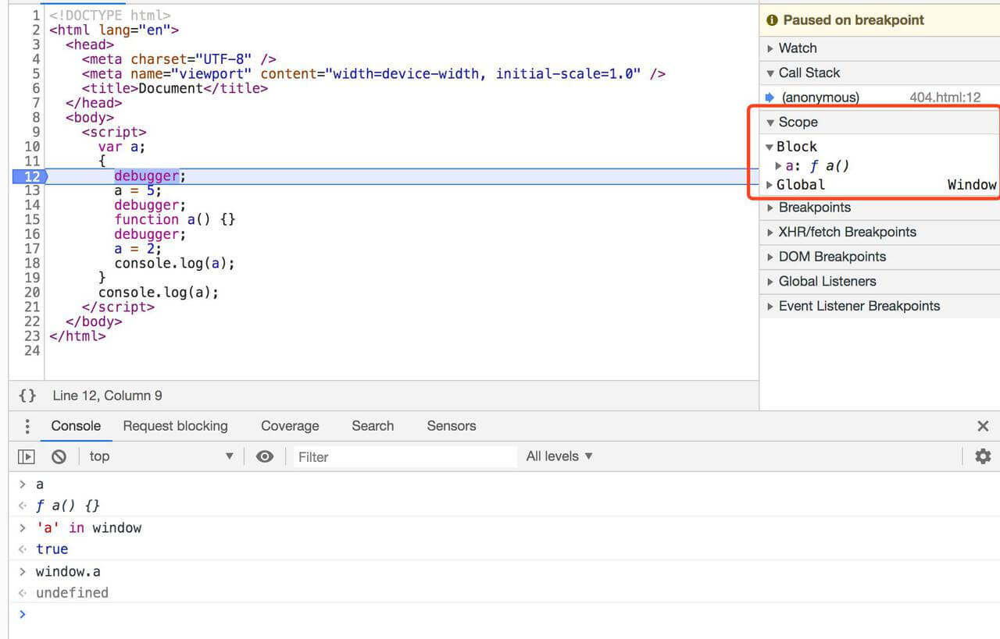
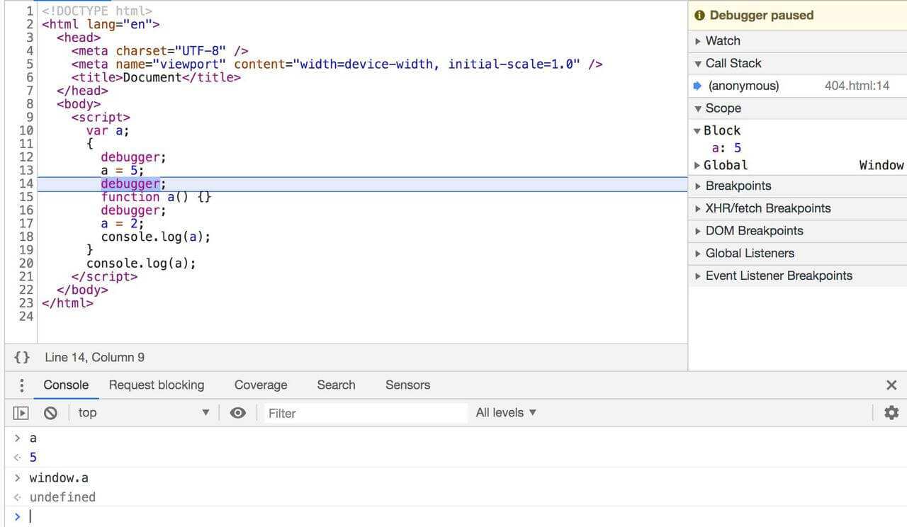
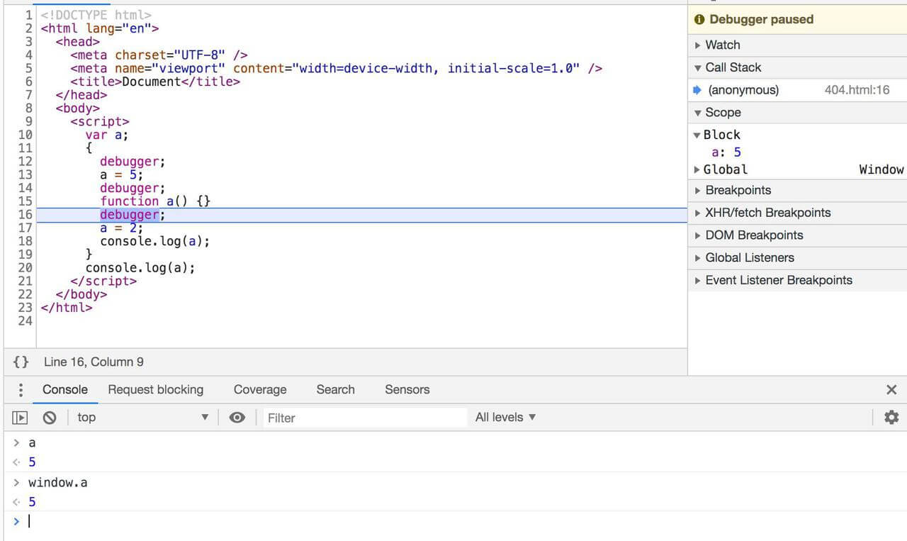
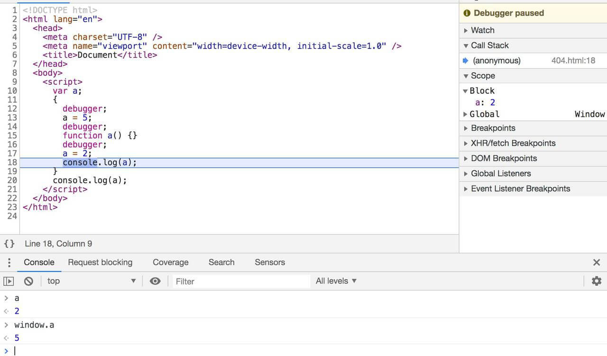

本文始于这样一道 JavaScript 题目。

```js
var a;
if (true) {
  a = 5;
  function a() {}
  a = 2;
  console.log(a);
}
console.log(a);
```

<!-- more -->

**这种写法是十分不建议在生产环境中使用**，而且在不同的浏览器中会有不同的表现，本文所有结果都是在 Chrome 80.0.3987.132 中运行得到的。

但上述代码片段的结果却十分神奇，它的运行结果是：

```bash
2
5
```

在详细研究这道题之前，先回顾下两项概念。顺便一提，全文结束也给不出一个这道题的“为什么”。

## 函数声明提升

众所周知，在 JS 当中，代码一的写法实际上可以看成是按照代码二的步骤来运行的。

代码一：

```js
hoisted(); // "foo"

function hoisted() {
  console.log('foo');
}
```

代码二：

```js
var hoisted;

hoisted = function () {
  console.log('foo');
};

hoisted(); // "foo"
```

根据 MDN 的描述，函数提升：

> Function declarations in JavaScript are hoisted to the top of the enclosing function or global scope.

指 JS 中函数的定义会被提升到**方法作用域**或**全局作用域**的顶部。但当加入**块级作用域**的时候，事情就变得复杂了起来。

## 有条件地创建函数

本节摘自 MDN：

```js
var hoisted = 'foo' in this;

console.log(
  `'foo' name ${
    hoisted ? 'is' : 'is not'
  } hoisted. typeof foo is ${typeof foo}`,
);

// 在 Chrome 里:
// 'foo' 变量名被提升，但是 typeof foo 为 undefined
//
// 在 Firefox 里:
// 'foo' 变量名被提升. 但是 typeof foo 为 undefined
//
// 在 Edge 里:
// 'foo' 变量名未被提升. 而且 typeof foo 为 undefined
//
// 在 Safari 里:
// 'foo' 变量名被提升. 而且 typeof foo 为 function

if (true) {
  function foo() {
    return 1;
  }
}
```

可以看到 `foo` 变量被提升为全局的 `foo`，符合前文变量提升的描述，姑且可以用下面的方式去描述这段代码的执行步骤：

> 暂且只以 Chrome 中的运行效果为准，而实际上我认为 Safari 中的表现才符合预期中的效果。

```js
var foo;

if (true) {
  foo = function () {
    return 1;
  };
}
```

但用这种方式代入开篇的题目中时，会发现并不是这样的。

## 调试题目

借助 Chrome DevTools 跟踪代码每一步的运行，当运行至花括号`{`时，发现多了一个块级作用域，同时块级作用域中有一个局部变量 `a`：

> 本断代码把 if 省略了，效果一样；同时添加了不少 debugger 方便断点。



并且局部 `a` 的值是块级作用域内定义的函数，同时全局的 `window.a` 依旧是 `undefined`。

> 此时我的内心想法：函数不是应该被提升到顶级作用域吗，不仅不是，从哪里又冒出了一个局部变量，黑人问号.jpg

经过 `a = 5` 的赋值后，局部变量的 `a` 为 `5`，`window.a` 依旧是 `undefined`。



执行完**函数声明**语句后，`window.a` 神奇地变为了 `5`。我觉得此时看到的只是表面上的代码了，背后解释器的运行一定有其他的行为，但对于这些我现在还不得而知。



最后 `a = 2` 的赋值也只是改变了局部变量 `a`，当跳出块级作用域后，只能访问到 `window.a`，最终得到了开篇的描述的结果。



## 结语

这个事情没能得到一个明确的解释说明实际上挺烦人的，感觉自己学的知识被“侮辱”了 😆，目前只能庆幸这是一种被极力反对的写法，现实当中并不会遇到。

要是有大佬能现身帮忙点拨一番，不胜感激！

还有关于有条件地创建函数，我想真不会有人像这样编码吧：

```js
// ❌
if (condition) {
  function foo() {
    return 'true';
  }
} else {
  function foo() {
    return 'false';
  }
}

foo();
```

一般而言，应该是这样比较多才对：

```js
function foo() {
  return !!condition + '';
}

foo();
```

或者，真想进行**有条件地创建函数**，也建议使用不会有提升现象的函数表达式：

```js
var foo;

// if 语句或者三元表达式
if (condition) {
  foo = function () {
    return 'true';
  };
} else {
  foo = function () {
    return 'false';
  };
}

foo();
```

最后，祝全天下的女神节日快乐哦~

完。

---

参考资料：

- [Hoisting（变量提升](https://developer.mozilla.org/zh-CN/docs/Glossary/Hoisting)
- [function declaration](https://developer.mozilla.org/en-US/docs/Web/JavaScript/Reference/Statements/function)
