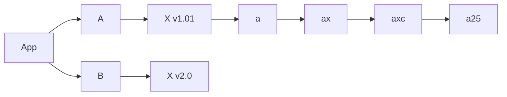
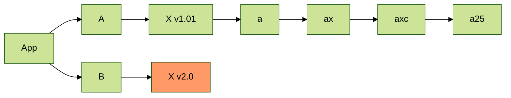

这里是概览、前言，这里是概览、前言，这里是概览、前言，这里是概览、前言，这里是概览、前言，这里是概览、前言，这里是概览、前言，这里是概览、前言，这里是概览、前言，这里是概览、前言，这里是概览、前言，这里是概览、前言。

<!-- more -->

这里是正文这里是正文这里是正文这里是正文这里是正文这里是正文这里是正文。

## 标题 2

文字。

### 标题 3

文字。

#### 标题 4

文字。

##### 标题 5

文字。

###### 标题 6

文字。

## 测试绘图

默认主题：



指定 `forest` 主题：



测试图片：

网络：


本地：


```ts
interface Type {
  name?: string;
  id: string;
}

const a: Type = {
  name: 'name-name',
  id: 'id',
};
```
