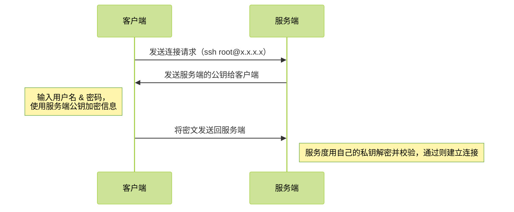
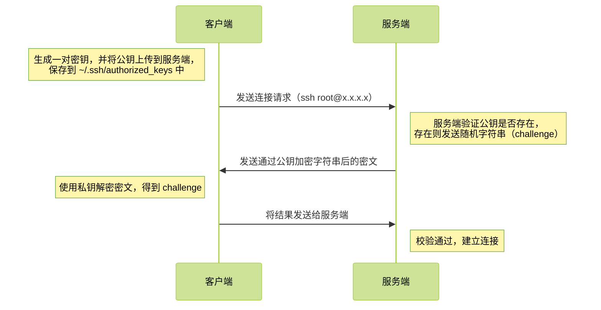
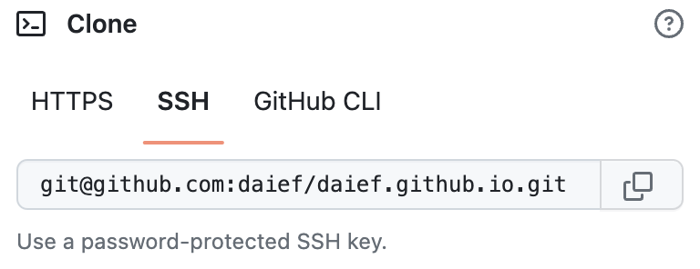

不知道有多少人和我一样，对 SSH key 的接触起始于 Git 的使用，反正是啥也不懂，跟着教程一顿敲：

```bash
$ ssh-keygen -t rsa -b 2048 -C "xxxxxxxxxx@qq.com"
```

一路回车，然后把 `id_rsa.pub` 的内容填入到 Github/Gitlab 的设置里，就转头去使用 Git 了。

<!-- more -->

# SSH

先说 SSH，SSH（Secure Shell）是一种安全的网络协议，用于在网络上远程连接和管理计算机系统。它可以加密数据并确保数据传输的完整性，从而提供了一种安全的远程访问方式。

通过使用 SSH，用户可以从本地计算机连接到远程计算机并在远程计算机上执行各种操作，例如查看、编辑和上传文件，安装软件，启动服务等等。SSH 还支持端口转发，允许用户通过 SSH 隧道访问本地网络资源，从而增强了网络安全性。

SSH 协议使用公钥加密技术，使得数据传输过程中即使被窃听也不会被破解。同时，SSH 协议还提供了认证机制，确保只有授权用户才能访问远程计算机系统。

由于其安全性和可靠性，SSH 已经成为远程管理和文件传输中最常用的协议之一，广泛应用于 Linux 和其他 Unix 系统中。

在 Windows 上，可以通过安装 OpenSSH 以获得 SSH 的服务端/客户端能力。

## SSH key

开头命令生成的内容就是 SSH key，公密钥组成一对，用于 SSH 连接，`id_rsa.pub` 就是公钥，`id_rsa` 是私钥，需要妥善保管。

> 公钥加密技术也称非对称式密码学，它需要两个密钥，一个是公开密钥，另一个是私有密钥；公钥用作加密，私钥则用作解密。使用公钥把明文加密后所得的密文，只能用相对应的私钥才能解密并得到原本的明文，最初用来加密的公钥不能用作解密。由于加密和解密需要两个不同的密钥，故被称为非对称加密；不同于加密和解密都使用同一个密钥的对称加密。公钥可以公开，可任意向外发布；私钥不可以公开，必须由用户自行严格秘密保管，绝不透过任何途径向任何人提供，也不会透露给被信任的要通讯的另一方。

前文只体现了非对称加密，但私钥从未暴露过，服务端是如何解密数据的呢？其实非对称加密只用于身份认证阶段，当建立了安全连接只会，数据都是通过对称加密传输的。这与加密方式的特性也有关系：

- 非对称加密：加密和解密需要两个不同的密钥，故被称为非对称加密；私钥不需要公开，加密效率较低
- 对称加密：加密和解密都使用同一个密钥，密钥需要经过网络传输，加密效率高

## 认证过程

SSH 连接有两种认证方式：密码认证和密钥认证，下面分别是两种方式的认证流程。

**密码认证：**



**密钥认证（免密登录）：**



当第一次登录某台服务器的时候，会出现如下提示：

```bash
The authenticity of host 'x.x.x.x (x.x.x.x)' can't be established.
ED25519 key fingerprint is SHA256:mewI2GS1WD86ckuE89JPn4CpljUqGngkQD4slRogDQE.
This key is not known by any other names
```

这段话的意思是，无法确认 host 主机的真实性，只知道它的公钥指纹，是否继续连接？为什么会存在这个提示，是因为存在中间人攻击。

> 中间人攻击：
>
> 这个过程本身是安全的，但是实施的时候存在一个风险：如果有人截获了登录请求，然后冒充远程主机，将伪造的公钥发给用户，那么用户很难辨别真伪。因为不像 https 协议，SSH 协议的公钥是没有证书中心（CA）公证的，也就是说，都是自己签发的。
>
> 可以设想，如果攻击者插在用户与远程主机之间（比如在公共的 wifi 区域），用伪造的公钥，获取用户的登录密码。再用这个密码登录远程主机，那么 SSH 的安全机制就荡然无存了。这种风险就是著名的中间人攻击。

所以用户需要根据指纹来确定是否连接到了正确的主机，如果指纹不一致，就需要终止连接。

又一个问题就是，用户怎么知道远程主机的公钥指纹应该是多少？回答是没有好办法，远程主机必须在自己的网站上贴出公钥指纹，以便用户自行核对。

用户确认之后，继续并完成连接后，该主机以及公钥信息就会保存在 `~/.ssh/known_hosts`，后续连接也将不再出现提示：

```bash
Warning: Permanently added 'x.x.x.x' (ED25519) to the list of known hosts.
```

# Git

再次回到开头的命令，命令的含义是指定使用 RSA 算法、长度 2048 生成一对密钥，`-C` 是可选的，指定注释信息，内容会追加在公钥后面：

```bash
$ ssh-keygen -t rsa -b 2048 -C "xxxxxxxxxx@qq.com"
```

而对于 Git，推荐使用 SSH 的连接方式，故一般在入门 Git 时都会去使用 ssh-key 生成密钥对。



# 使用 Ed25519 算法

一般网上通过使用 ssh-key 生成密钥对时都使用 RSA 算法，RSA 经典且可靠，但性能不够理想。

[Practical Cryptography With Go ](https://leanpub.com/gocrypto/read#leanpub-auto-chapter-5-digital-signatures)一书建议使用 ED25519 密钥，ED25519 比 RSA 更安全且性能更好。

OpenSSH 6.5 在 2014 年开始支持 ED25519 SSH 密钥，目前应该在大多数操作系统上都能支持。

为了使用 Ed25519 只需更改 `-t` 参数：

```bash
$ mkdir -p ~/.ssh && cd ~/.ssh

$ ssh-keygen -t ed25519  -C "xxxxx@zz.com"
```

在生成密钥的时候，会提示输入密码，这个密码是用来保护私钥的，如果不想设置密码，直接回车即可。但为了安全考虑，十分有必要设置密码。这样即使私钥丢失或被盗，也不会轻易被他人使用。

# 管理多对 SSH key 和多个 Git 账户

以 Git 为例，往往一个人会拥有多个平台的账号，比如 GitHub、GitLab、公司 Git 等，这时建议为每个服务生成一对专用的密钥。而多对密钥、多个 Git 账户的管理又是个新的问题，不过好在通过简单的配置，就能轻松解决了。

首先针对不同平台生成秘银：

```bash
$ mkdir -p ~/.ssh && cd ~/.ssh

# 我在 GitHub
$ ssh-keygen -t ed25519 -f my_github_ed25519  -C "me@github"

# 我在 GitLab
$ ssh-keygen -t ed25519 -f my_gitlab_ed25519  -C "me@gitlab"

# 我在企业
$ ssh-keygen -t ed25519 -f my_company_ed25519 -C "email@example.com"
```

编辑 `~/.ssh/config`：

```shell
# 我在 GitHub
Host github.com
  Hostname github.com
  User git
  PreferredAuthentications publickey
  IdentityFile ~/.ssh/my_github_ed25519

# 我在 GitLab
Host gitlab.com
  Hostname gitlab.com
  User git
  PreferredAuthentications publickey
  IdentityFile ~/.ssh/my_gitlab_ed25519

# 我在企业
Host example.com
  Hostname example.com
  Port 22
  User git
  PreferredAuthentications publickey
  IdentityFile ~/.ssh/my_company_ed25519
```

如此一来 SSH 连接不同服务器时，就会自动使用相应的密钥了。

而对于多个 Git 账户，可以通过配置 `~/.gitconfig` 来实现：

```toml
# 全局账户
[user]
name=daief
email=xxxxxxxx@qq.com

# 以 / 结尾，否则不会生效，以 / 结尾，** 会被自动添加上，~/Desktop/codes/**
[includeIf "gitdir:~/Desktop/codes/"]
path = ~/Desktop/codes/.gitconfig

[includeIf "gitdir:~/Documents/fe/projects/"]
path = ~/Documents/fe/projects/.gitconfig
```

子配置分别是：

```toml
# ~/Desktop/codes/.gitconfig
[user]
name=user2
email=xxxxx2@qq.com

# ~/Documents/fe/projects/.gitconfig
[user]
name=user3
email=xxxxx3@qq.com
```

这样一来，当在 `~/Desktop/codes/` 目录下执行 Git 命令时，就会使用 `~/Desktop/codes/.gitconfig` 配置；而在 `~/Documents/fe/projects/` 目录下执行 Git 命令时，就会使用 `~/Documents/fe/projects/.gitconfig` 配置；否则就是使用全局配置。

# 总结

其实最开始只是寻找管理多个 Git 账号的解决方案，期间接触了不少别的知识，想着就干脆都了解一下，再整合记录一下。

---

参考资料：

- SSH 认证原理：<https://www.jianshu.com/p/d31de2601368>
- 公开密钥加密：<https://zh.wikipedia.org/zh-hans/%E5%85%AC%E5%BC%80%E5%AF%86%E9%92%A5%E5%8A%A0%E5%AF%86>
- Install OpenSSH for Windows：<https://learn.microsoft.com/en-us/windows-server/administration/openssh/openssh_install_firstuse>
- Use SSH keys to communicate with GitLab：<https://docs.gitlab.com/ee/user/ssh.html>
- Ed25519：<https://ed25519.cr.yp.to/>
- 使用 Ed25519 算法生成你的 SSH 密钥：<https://zhuanlan.zhihu.com/p/110413836>
- Multiple GitHub accounts on the same computer?：<https://stackoverflow.com/questions/3860112/multiple-github-accounts-on-the-same-computer>
