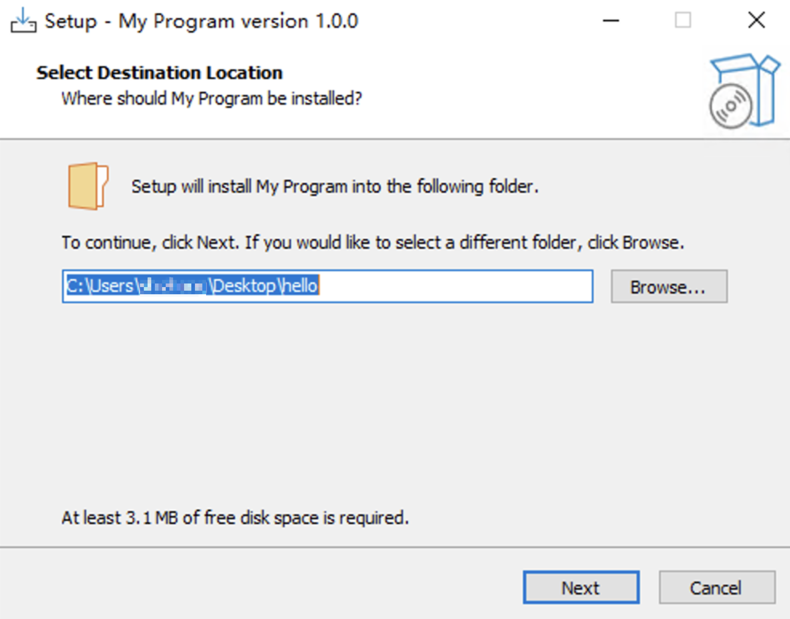
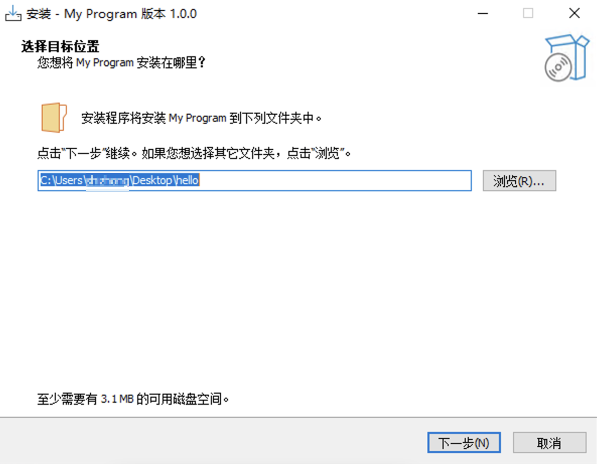
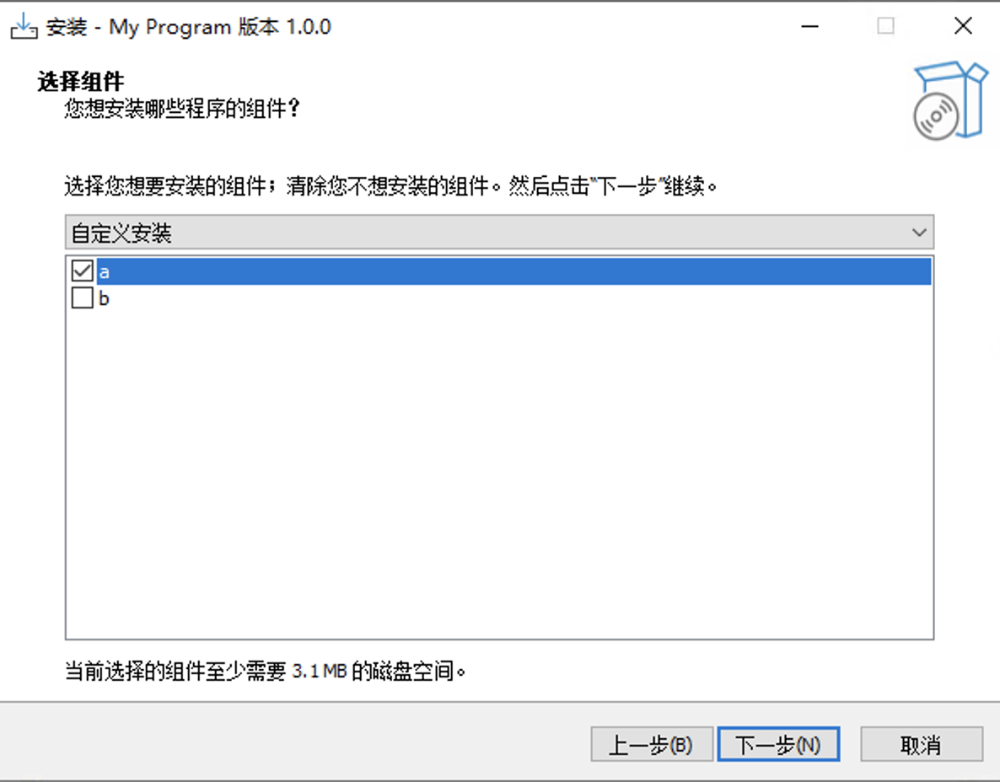
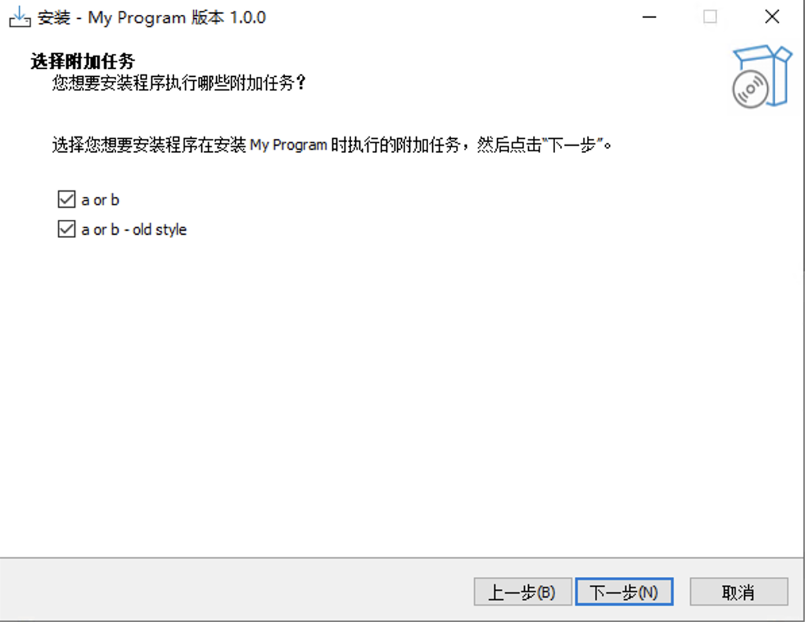
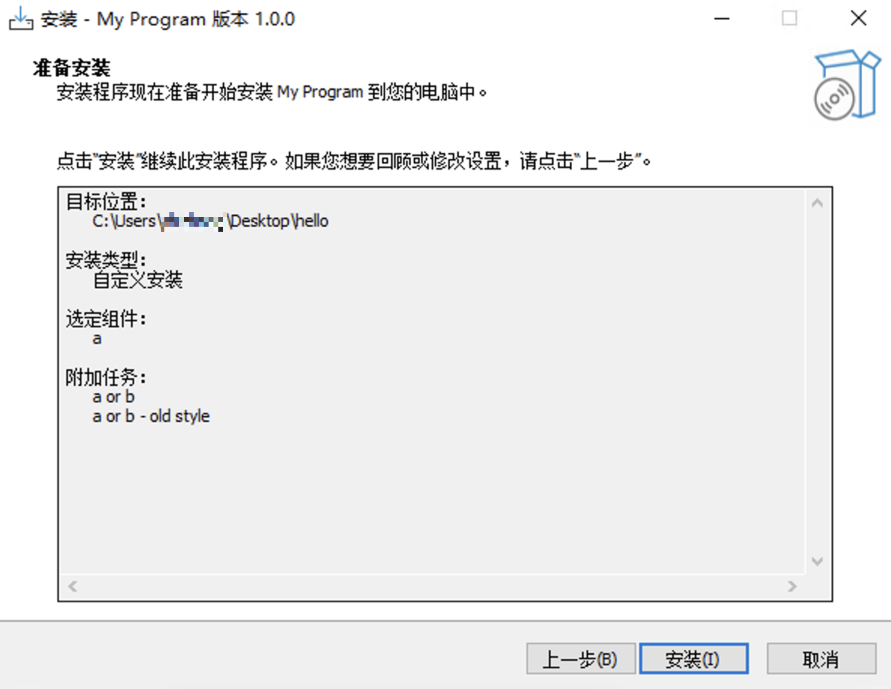

最近工作上遇到了 Inno Setup，这对于我来说是个新东西，看不懂，那么就学一下吧。

<!-- more -->

## 安装 & 起步

> 当前所使用的 Inno Setup 版本是 6.2.2

Inno Setup（后文将简称为 Inno） 是一个开源的安装包制作工具，小巧但强大，官网下载地址：<https://jrsoftware.org/isinfo.php>。

官方文档：<https://jrsoftware.org/ishelp/>

下载安装之后打开 Inno，实际上是一个编辑器，可以直接编辑脚本，可以编译、运行脚本，生成安装程序。

选择新建脚本，写入以下内容：

```ini
[Setup]
AppName=My Program
AppVersion=1.0.0
DefaultDirName="{userdesktop}\hello"
```

点击编译（Compile），在对话框中选择保存脚本（比如 hello.iss），之后在脚本的同级会生成一个 `Output`，里面有一个 `mysetup.exe`。

双击 `mysetup.exe` 就开始安装引导了：



回顾上述脚本：

- `[Setup]`：此部分包含安装程序和卸载程序使用的全局设置，该 `Section` 是必须的
- `AppName` 和 `AppVersion` 分别定义应用程序的名称和版本
- `DefaultDirName` 是默认的安装目录，这里使用了一个**常量** `userdesktop`，表示用户桌面的路径

根据安装引导的提示完成安装，最终会在指定路径创建一个文件夹，包含如下卸载程序：

- unins000.dat
- unins000.exe

除了手写脚本，Inno 本身自带可视化的界面去制作安装程序，在可视化界面中一步步进行下去，最后可以将一系列操作保存为一份脚本。可视化的操作很方便易学，不过这里不对可视化操作进行过多介绍了，主要还是学习一下脚本的编写。

## 脚本学习

### iss 脚本概览

每一个 iss 脚本由若干个 `Section` 组成，每个 `Section` 有各自的职责。一个 `Section` 由方括号 `[]` 包裹，其中包含 `Section` 的名称。在每个 `Section` 内可以包含任意数量的条目。

`Section` 可以分为两类：

- 像 `[Setup]` 这样，它的条目由指令名称和值（形式为 Directive=Value）构成
- 以及像 `[Files]` 这样，它的条目是由多个键值对通过分号连接而成，这种形式下的键值对又称为参数（Parameter）

```ini
[Setup]
AppName=My Program

[Files]
Source: "MYPROG.EXE"; DestDir: "{app}"
```

> 注意：
>
> - 每个 `Section` 内部的条目可以使用相同的名称
> - 可以存在多个同名 `Section`
> - 默认情况下，指令值中的任何前导或尾随空格都将被删除。可以通过在指令值周围加上双引号 `"` 来避免
> - iss 本身大小写不敏感，但是需要注意有些“值”的书写方式，比如应用名称会在某些地方直接展示给用户，故不可随意书写

iss 的注释由 `;` 开头，`[Code]` 部分的注释另有两种方式：

```ini
[Setup]
; AppName 指定应用程序的名称，这是一条注释
AppName=My Program

[Code]
// 单行注释
(* 多行注释 *)
```

支持类似 C 语言的 `#include` 指令，它可以将另一个文件中的内容插入到脚本中指令所在的位置。

```c
#include "filename.txt"
```

如果文件名不是绝对路径，编译器将在 iss 文件所在目录中查找。文件名可以以 `compiler:` 为前缀，在这种情况下，它会在编译器目录中查找该文件。

> `compiler:` 为前缀时，查找编译器目录，指的就是 Inno Setup 的安装目录。

支持 `#preproc` 指令，该指令指定是否使用内置预处理器（仅支持上述 #include 指令）或使用 Inno 预处理器 (ISPP)，后者支持更多的指令。

```text
#preproc builtin
#preproc ispp
```

默认情况下，iss 脚本使用 ISPP（如果可用），而 .isl 文件使用内置（built-in）预处理器。

### 多语言

Inno 官方自带一部分多语言，可以在 Inno 安装目录下的 `Languages` 文件夹中找到。

对于官方未支持的多语言（比如中文），可以在 <https://jrsoftware.org/files/istrans/> 下载，下载之后保存到 Inno 的 `Languages` 文件夹中，命名为 `ChineseSimplified.isl`。

> 注意：文件格式不能是 UTF-8，需要是 UTF-8 with BOM 或者是 GBK 编码（可能还有其他可行的编码，但没尝试过），否则会出现中文乱码。

针对最开始的脚本，添加中文支持，重新编译并运行：

```ini
[Setup]
AppName=My Program
AppVersion=1.0.0
DefaultDirName="{userdesktop}\hello"
WizardStyle=modern

; 新增 Languages Section，指定为中文
[Languages]
Name: chinesesimp; MessagesFile: "compiler:Languages\ChineseSimplified.isl"
```



### 常量（Constants）

前文 `DefaultDirName="{userdesktop}\hello"`、`Source: "MYPROG.EXE"; DestDir: "{app}"` 中的 `userdesktop` 和 `app` 都是常量，安装和卸载的过程中，常量会被替换为用户选择的值或系统配置中的值。

比如，`{app}` 常量会被替换为应用程序的安装目录，`{userdesktop}` 常量会被替换为用户桌面的路径。

完整的常量列表可以参考官方文档的常量章节。

### 公共参数（Common Parameters）

公共参数是指能在所有 `Section` 中都能被使用的参数，共有三条：

- `Languages`
- `MinVersion`
- `OnlyBelowVersion`

> TODO 待完善

### Components 和 Tasks 参数

除了 `[Types]`、`[Components]` 和 `[Tasks]`，其他 `Section` 都支持 `Components` 和 `Tasks` 两个可选参数。

#### Components 参数

一个由空格分隔的组件名称列表，告诉安装程序该条目属于哪些组件。如果最终用户从此列表中选择了一个组件，则会处理该条目（例如：安装文件）。

没有 `Components` 参数的条目始终会被处理，除非有其他参数（比如后文的 Check）指示不应该这样做。

```ini
[Files]
Source: "MYPROG.EXE"; DestDir: "{app}"; Components: main
Source: "MYPROG.CHM"; DestDir: "{app}"; Components: help
Source: "README.TXT"; DestDir: "{app}"
```

#### Tasks 参数

一个以空格分隔的任务名称列表，告诉安装程序该条目属于哪个任务。如果最终用户从此列表中选择了一个任务，则会处理该条目（例如：安装文件）。

没有 `Tasks` 参数的条目始终会被处理，除非其他参数说明不应该这样做。

> 请注意，在“选择开始菜单文件夹”向导页面上的“不创建开始菜单文件夹”复选框不影响具有 Tasks 参数的 `[Icons]` 条目，因为它们有自己的复选框。

```ini
[Icons]
Name: "{group}\My Program"; Filename: "{app}\MyProg.exe"; Components: main; Tasks: startmenu
Name: "{group}\My Program Help"; Filename: "{app}\MyProg.chm"; Components: help; Tasks: startmenu
Name: "{commondesktop}\My Program"; Filename: "{app}\MyProg.exe"; Components: main; Tasks: desktopicon
```

除了空格分隔的列表，还可以将布尔表达式用作组件和任务参数。支持的运算符包括 `not`、`and` 和 `or`。

```ini
[Components]
Name: a; Description: a
Name: b; Description: b

[Tasks]
Name: p; Description: a or b; Components: a or b
Name: q; Description: a and b; Components: a and b
Name: r; Description: not a or b; Components: not a or b
Name: s; Description: not (a or b); Components: not (a or b)
Name: t; Description: a or b - old style; Components: a b
```

#### 尝试

上面都是摘自官方的解释，但到底是什么表现呢？

在脚本中新增 `Components` 和 `Tasks` 的相关内容，重新编译并运行：

```ini
[Setup]
AppName=My Program
AppVersion=1.0.0
DefaultDirName="{userdesktop}\hello"
WizardStyle=modern

[Languages]
Name: chinesesimp; MessagesFile: "compiler:Languages\ChineseSimplified.isl"

[Components]
Name: a; Description: a
Name: b; Description: b

[Tasks]
Name: p; Description: a or b; Components: a or b
Name: q; Description: a and b; Components: a and b
Name: r; Description: not a or b; Components: not a or b
Name: s; Description: not (a or b); Components: not (a or b)
Name: t; Description: a or b - old style; Components: a b
```

- 
- 
- 

- `[Components]`、`[Tasks]` 定义了组件和任务（选项）
- `Components`、`Tasks` 参数就是根据条件（用户实际的选择组件或任务）来控制条目是否被处理

## Sections 学习

### [Setup]

文档：<https://jrsoftware.org/ishelp/topic_setupsection.htm>

`[Setup]` 包含安装程序和卸载程序使用的全局设置，是必须的。同时 `[Setup]` 下的 `AppName`、`AppVersion` 和 `DefaultDirName` 指令也是必填的。

`[Setup]` 包含多达 150+ 的指令，这里只挑几个过一过，实际则用到的时候再对照文档去看了。

指令大体分为三类：

- 编译相关（Compiler-related），可以理解为会影响编译行为的指令，如：
  - Output：可以设置为 `yes` 或 `no`，默认为 `yes`，如果设置为 `no`，编译器将仅检查脚本中的错误并跳过创建安装文件
  - OutputDir：指定输出目录，默认为 `Output`，可以设置为绝对路径或相对路径
- 安装相关（Installer-related），影响安装/卸载程序的操作，如：
  - AppName：该指令是必须，指定正在安装的应用程序名称。**不要包括版本号，因为这由 AppVersion 和/或 AppVerName 指令定义**。AppName 会显示在窗口标题、向导页面和对话框中
  - AppVerName：该指令包含应用的名称和版本号，默认由 AppName 与 AppVersion 拼接而成，如果未设置 AppVersion 则该指令是必须的
- 和修饰类（Cosmetic），只影响安装程序的外观，如：
  - SetupIconFile：指定安装/卸载程序的图标，编译器会在源目录中查找图标文件，除非是绝对路径或以 `compiler:` 开头的路径

### [Types]

需要与 `[Components]` 配合使用，相当于预定义一组集合，方便用户选择组件：

唯一 Flags 参数的值是 `iscustom`，表示该类型是自定义类型，如果不定义自定义类型，则只允许用户选择预定义的类型，并且无法再手动选择/取消选择组件。

```ini
[Types]
Name: "a"; Description: "Full installation"
Name: "b"; Description: "Compact installation"
Name: "c"; Description: "Custom installation"; Flags: iscustom
```

### [Components]

前文已有介绍，这里只说明与 `[Types]` 配合的使用：

```ini
[Components]
Name: "c1"; Description: "c1"; Types: a b c; Flags: fixed
Name: "c2"; Description: "c2"; Types: a b
Name: "c3"; Description: "c3"; Types: a
```

因为定义了 `[Types]`，组件选择时会有三个选项，分别是 `Full installation`、`Compact installation` 和 `Custom installation`：

- 选择 `Full installation` 会自动勾上 `c1`、`c2` 和 `c3`
- 选择 `Compact installation` 会自动勾上 `c1` 和 `c2`
- 若用户选择 `Custom installation`，则可以手动勾选 `c2` 和 `c3`
- `c1` 指定了 fixed，因此用户无法手动修改该选项

### [Dirs]

`[Dirs]` 定义了除用户选择的应用程序目录（自动创建）之外，安装程序需要创建的其他目录。在主应用程序目录下创建子目录是该 Section 常见的使用方式。

请注意，在使用 [Files] 部分安装文件时，不必显式地创建目录，因此该 Section 主要用于创建空目录。

```ini
[Dirs]
Name: "{app}\data"
Name: "{app}\bin"
```

### [Files]

该 Section 定义了安装程序需要安装的文件。换句话说，就是将定义的 Source 文件打包到安装程序中，安装的时候根据配置分别解压到特定目录。

```ini
[Files]
Source: "README.TXT"; DestDir: "{app}"; Flags: isreadme
; 支持通配符
Source: "subdir\*"; DestDir: "{app}\subdir"; Flags: isreadme
```

### [Icons]

该 Section 定义了安装程序如何在开始菜单或其他位置（如桌面）创建快捷方式。

> myapp.exe 是最终的可执行程序，也可以使用 Inno 自带的 demo 程序：`Inno 安装目录\Examples\MyProg.exe`。

```ini
[Icons]
; 创建桌面快捷方式
Name: "{group}\My Program"; Filename: "{app}\myapp.exe"; WorkingDir: "{app}"
```

### [Registry]

该 Section 定义了安装程序如何在注册表中创建、修改或删除键/值。

> 默认情况下，安装程序创建的注册表键和值在卸载时不会被删除。如果希望卸载程序的同时删除键或值，则 Flags 中须至少包含 uninsdelete、uninsdeletekeyifempty、uninsdeletevalue 中的一个。

下面是注册伪协议的例子，可通过在浏览器中输入 `myapp://` 来打开应用程序：

```ini
[Registry]
Root: HKCR; SubKey: Myapp; ValueData: "MyappProtocol"; ValueType: string; Flags: createvalueifdoesntexist uninsdeletekey noerror;
Root: HKCR; SubKey: Myapp; ValueName: "URL Protocol"; ValueData: "{app}\myapp.exe"; ValueType: string; Flags: createvalueifdoesntexist uninsdeletekey noerror;
Root: HKCR; SubKey: Myapp\DefaultIcon; ValueData: "{app}\myapp.exe"; ValueType: string; Flags: createvalueifdoesntexist uninsdeletekey noerror;
Root: HKCR; SubKey: Myapp\shell\open\command; ValueData: "{app}\myapp.exe --open-url=""%1"""; Flags: uninsdeletekey noerror; ValueType: string;
```

Flags 说明：

- createvalueifdoesntexist：注册表中不存在时才创建相应条目
- uninsdeletekey：卸载时删除该键
- noerror：不展示注册表键或值设置失败的信息

> 官方不建议直接操作注册表 HKCR，而是使用 `HKA\Software\Classes` 作为替代。理由暂时不清楚，同时注册表的相关知识也只了解了零星半点，边学边搞吧。

### [Run] & [UninstallRun]

- `[Run]` 定义了在安装完成之后需要执行的程序
- `[UninstallRun]` 定义了在卸载第一步需要执行的程序

```ini
[Run]
; 安装完成最后一步，关闭安装向导后是否允许 myapp.exe
Filename: "{app}\myapp.exe"; Description: "Run myapp"; Flags: nowait postinstall skipifsilent
```

## Pascal 脚本

除了上面看起来像是”配置式”的内容，Inno 还支持添加脚本（语法为 [Object Pascal](https://zh.wikipedia.org/zh-sg/Object_Pascal)）以实现自定义的逻辑，具有更多的创造性，比如：

- 支持在自定义条件下中止安装或卸载
- 支持在运行时添加自定义引导页面
- 支持在安装之前、期间或之后通过 Pascal 脚本来提取、调用 DLL 或其他文件
- 支持编写常量，这些常量可以执行普通常量、从注册表读取、从 ini 读取和从命令行读取等操作
- 支持在运行时根据自定义条件删除 `[Types]`、`[Components]` 或 `[Tasks]`
- 基于自定义条件，支持有条件地安装 `[Files]`、`[Registry]`、`[Run]` 等条目
- 提供了大量辅助函数，可通过 Pascal 脚本完成 Inno Setup 所能做到的几乎所有事情

> 注意：从这里开始，若无特殊说明，脚本特指 `[Code]` 中的 Pascal 脚本，脚本仅在运行时执行，因此不能干涉 iss 本身的编译

### [Code]

所有脚本内容的定义需要位于该 Section。

#### 事件函数

可以在 `[Code]` 定义事件回调函数，在适当的时机会被执行，例：

```pascal
[Code]
function InitializeSetup(): Boolean;
  begin
    if (Msgbox('是否继续安装', mbConfirmation, MB_YESNO) = IDYES) then
      Result := True
    else
      Result := False
    end;
  end.
```

定义事件函数 InitializeSetup，该函数会在安装初始化的时候被调用，返回值为 Boolean，如果返回 True 则继续安装，否则中止安装。上面的例子中，在初始化过程中加入了“弹出确认框”的逻辑，询问用户是否继续安装。

通常情况下，同一个事件只能定义一个回调函数的实现。但使用事件属性（Event Attributes）可以在脚本中拥有同一事件函数的多个实现。这在包含了实现事件函数的外部脚本中特别有用，以避免与主要脚本发生冲突。

以下是一个示例脚本，其中包含三个 InitializeWizard 事件函数的实现，每次触发会弹一个提示框，一共会弹三次：

```pascal
procedure InitializeWizard;
begin
  SuppressibleMsgBox('InitializeWizard called 1', mbInformation, MB_OK, IDOK);
end;

<event('InitializeWizard')>
procedure InitializeWizard2;
begin
  SuppressibleMsgBox('InitializeWizard called 2', mbInformation, MB_OK, IDOK);
end;

<event('InitializeWizard')>
procedure InitializeWizard3;
begin
  SuppressibleMsgBox('InitializeWizard called 3', mbInformation, MB_OK, IDOK);
end;
```

注意到，第二个定义需要使用了 `procedure` 关键字，而不是 `function`，两者都是子程序，但又有区别，简单来说：

- `procedure` 表示过程，不会直接返回值
- `function` 是函数，返回单个值

#### 脚本常量

这个例子演示了如何在脚本中使用常量，同时脚本中定义的函数也可以在其他地方使用，比如：

```pascal
[Setup]
DefaultDirName="{code:MyConst}"

[Code]
function MyConst(Param: String): String;
begin
  Result := ExpandConstant('{userdesktop}') + '/appdest';
end;
```

注意，`MyConst` 函数必须要定义一个参数。

同时，Inno [内置了许多函数](https://jrsoftware.org/ishelp/topic_scriptfunctions.htm)可以被直接使用：

```ini
[INI]
; GetShortName
FileName: "{app}\MyIni.ini"; Section: "MySettings"; Key: "ShortApp"; String: "{code:GetShortName|{app}}"
```

#### Check 参数

所有参数形式的 Section 都支持 `Check` 参数，可以在程序过程中根据条件决定是否生效，比如：

```ini
[Files]
Source: "MYPROG.EXE"; DestDir: "{app}"; Check: MyProgCheck
Source: "A\MYFILE.TXT"; DestDir: "{app}"; Check: MyDirCheck(ExpandConstant('{app}\A'))
Source: "B\MYFILE.TXT"; DestDir: "{app}"; Check: DirExists(ExpandConstant('{app}\B'))

[Code]
var
  MyProgChecked: Boolean;
  MyProgCheckResult: Boolean;

function MyProgCheck(): Boolean;
begin
  if not MyProgChecked then begin
    MyProgCheckResult := MsgBox('Do you want to install MyProg.exe to ' + ExtractFilePath(CurrentFileName) + '?', mbConfirmation, MB_YESNO) = idYes;
    MyProgChecked := True;
  end;
  Result := MyProgCheckResult;
end;

function MyDirCheck(DirName: String): Boolean;
begin
  Result := DirExists(DirName);
end;
```

注意：

- `[Files]` 中的条目如果包含通配符，`Check` 会对每一个文件都执行一次，而不是整个条目

#### BeforeInstall & AfterInstall 参数

所有参数形式的 Section 也都支持 `BeforeInstall` 和 `AfterInstall`，分别是在条目安装之前、之后执行：

```ini
[Files]
Source: "MYPROG.EXE"; DestDir: "{app}"; BeforeInstall: MyBeforeInstall
Source: "A\MYFILE.TXT"; DestDir: "{app}"; BeforeInstall: MyBeforeInstall2('{app}\A\MYFILE.TXT')
Source: "B\MYFILE.TXT"; DestDir: "{app}"; BeforeInstall: MyBeforeInstall2('{app}\B\MYFILE.TXT')
Source: "MYPROG.CHM"; DestDir: "{app}"; BeforeInstall: Log('Before MYPROG.CHM Install')

Source: "MYPROG.EXE"; DestDir: "{app}"; AfterInstall: MyAfterInstall
Source: "A\MYFILE.TXT"; DestDir: "{app}"; AfterInstall: MyAfterInstall2('{app}\A\MYFILE.TXT')
Source: "B\MYFILE.TXT"; DestDir: "{app}"; AfterInstall: MyAfterInstall2('{app}\B\MYFILE.TXT')
Source: "MYPROG.CHM"; DestDir: "{app}"; AfterInstall: Log('After MYPROG.CHM Install')

[Code]
procedure MyBeforeInstall();
begin
  MsgBox('About to install MyProg.exe as ' + CurrentFileName + '.', mbInformation, MB_OK);
end;

procedure MyBeforeInstall2(FileName: String);
begin
  MsgBox('About to install ' + FileName + ' as ' + CurrentFileName + '.', mbInformation, MB_OK);
end;

procedure MyAfterInstall();
begin
  MsgBox('Just installed MyProg.exe as ' + CurrentFileName + '.', mbInformation, MB_OK);
end;

procedure MyAfterInstall2(FileName: String);
begin
  MsgBox('Just installed ' + FileName + ' as ' + CurrentFileName + '.', mbInformation, MB_OK);
end;
```

注意：

- 所有 BeforeInstall 和 AfterInstall 的函数不应该拥有返回值
- 如果安装程序已确定不应处理该条目，则不会调用 BeforeInstall 或 AfterInstall 函数
- `[Files]` 中的条目如果包含通配符，BeforeInstall 和 AfterInstall 会对每一个文件都执行一次，而不是整个条目

#### 调用 DLLs 和 .Net 程序集

脚本可以调用外部 DLL 中的函数，这包括标准 Windows DLL 中的标准 Win32 API 函数和自定义制作的 DLL 中的自定义函数。此外，还可以调用 .NET 程序集。

> 先知道有这么个能力吧，实际还没用到过

#### 使用 COM Automation Objects

> 这些概念属实没接触过，感觉上也是能直接调用一些系统或系统库的能力

脚本可以通过 COM Automation 对象支持来访问 COM（也称为 OLE 或 ActiveX）方法和属性。这使得可以访问标准 Windows COM 服务器、自定义 COM 服务器、Visual Basic ActiveX DLL 和 .NET 程序集，可以通过 COM Interop 进行交互。

- IDispatch based COM
  - 可通过 CreateOleObject 和 GetActiveOleObject 来初始化基于 IDispatch 的 COM
- IUnknown based COM
  - 如果对象没有实现 IDispatch 接口，可以使用 CreateComObject 来初始化基于 IUnknown 的 COM

如下是一个通过 WinHttpRequest 发送 HTTP 请求的例子：

```ini
[Code]
procedure SendHttp;
  begin
    WinHttpReq := CreateOleObject('WinHttp.WinHttpRequest.5.1');
    WinHttpReq.Open('POST', 'https://api.exapmle.com', false);
    WinHttpReq.SetRequestHeader('Content-Type', 'application/json');
    WinHttpReq.Send('{"key":"value"}');
  end;
```

## 结语

根据文档说明，每个 Section 逐步试验下来，基本上浅浅了解了下 Inno 的各个方面。Inno 本身不难，就是各种指令、参数、Flags 以及内置函数比较多，想要全盘熟悉、用得顺手也不容易。对于 Pascal 语言，虽然没接触过，但有编程经验学点简单的写法很轻松。

个人而言，最棘手的还是 Windows 平台开发相关的内容，比如注册表的修改，为什么改这个键，为什么设置这个值，这需要查询另外的资料；比如 `[Code]` 脚本中，可以调用哪些能力，这也需要额外的知识和经验，这些都是我目前未接触的领域。

总之，Inno 不难，以后随着实际使用再慢慢深入吧。

---

参考资料：

- 官方文档：<https://jrsoftware.org/ishelp/>
- Object Pascal：<https://zh.wikipedia.org/zh-sg/Object_Pascal>
- Pascal 教程：<https://www.jc2182.com/pascal/pascal-jiaocheng.html>
