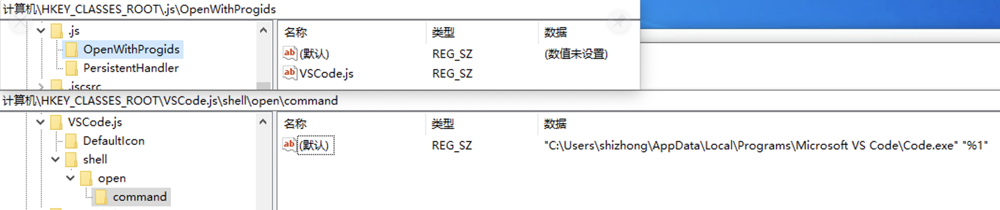
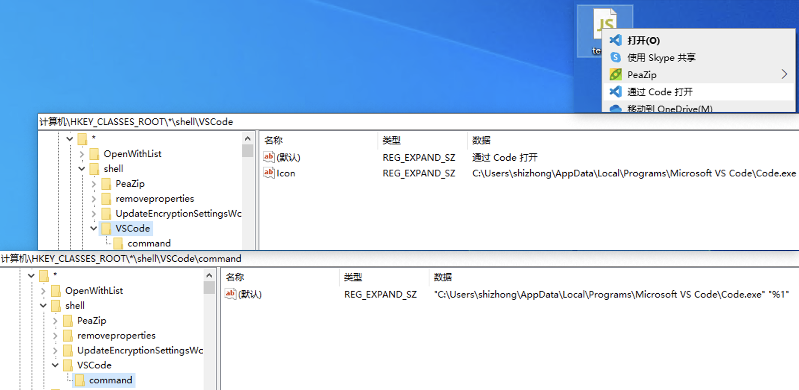

最近在做一个 Electron 桌面应用，需要实现文件关联，把特定后缀的文件关联到应用上，双击文件可以直接打开应用并读取文件。

文件关联与操作系统相关性比较大，不同的操作系统实现方式也会不同。不过如果使用 [electron-builder](https://www.electron.build/) 进行应用打包，可以直接通过 [fileAssociations](configuration/configuration.html#overridable-per-platform-options) 配置来实现文件关联。

而我这边使用 [electron-packager](https://github.com/electron/electron-packager) 打包，不会直接产出安装程序，所以需要自行实现文件关联，同时可以借机进一步了解 Windows 和 Mac 实现文件关联的细节。

<!-- more -->

# 文件关联

文件关联的实现和表现在不同的操作系统上会有所不同，但核心期望是一致的：

- 应用安装完成后，特定的文件类型会自动关联到应用上，文件图标需要根据配置有所变化
- 双击能够直接通过目标应用打开；或者右键在其他应用中能够选择目标应用
- 应用卸载后，文件关联需要解除、文件图标显示的恢复

## Windows

Windows 的文件关联是通过注册表实现的，注册表中的 `HKEY_CLASSES_ROOT（HKCR）` 节点包含了文件扩展名关联信息。

> 在实际的注册表中，不推荐直接修改 `HKEY_CLASSES_ROOT`，而是修改 `HKEY_CURRENT_USER\Software\Classes` 或 `HKEY_LOCAL_MACHINE\Software\Classes`。
>
> `HKEY_CLASSES_ROOT` 是 `HKEY_LOCAL_MACHINE\Software\Classes` 和 `HKEY_CURRENT_USER\Software\Classes` 的合并，如果两个节点中都有相同的键，那么 `HKEY_CURRENT_USER\Software\Classes` 会覆盖 `HKEY_LOCAL_MACHINE\Software\Classes` 中的键。
>
> 本文为了表述方便，都直接使用 `HKEY_CLASSES_ROOT`。

打开“注册表编辑器”，找到其中 `HKEY_CLASSES_ROOT\.js` 节点，该节点存储了 `.js` 文件类型的关联信息；`HKEY_CLASSES_ROOT\VSCode.js` 节点存储了 `.js` 文件类型的默认应用信息。

> 注：这里是以 vscode 的注册表信息为例，需要安装了 vscode 才会有这些内容。



要实现文件关联，就要做到图中的效果，根据理解，主要包含两个步骤：

1. 注册应用程序 ProgId，即图中的 `VSCode.js`

   - DefaultIcon：设置文件图标
   - shell\open\command：设置通过文件打开时的命令，`%1` 就是目标文件的路径，这里会影响程序中的读取

2. 注册文件扩展名关联信息，即图中的 `.js`，在 `OpenWithProgids` 中设置关联的应用程序，上图中的 `VSCode.js` 就是关联的目标应用

我的应用程序使用 `Inno Setup` 制作安装程序，基于 `Inno Setup` 可以很方便地在安装/卸载过程修改注册表。

比如有一个 `MyProg.exe` 程序，想要关联 `.myp` 后缀的文件，那么 Inno Setup 脚本可以是这样（只保留了关键信息）：

```ini
[Setup]
; 这一行能在安装/卸载之后自动刷新资源管理器，避免图标缓存的问题
ChangesAssociations=yes

[Registry]
; 创建 ProgID
Root: HKCR; SubKey: "MyProg.myp"; ValueData: "myp 自定义文件"; ValueType: string; Flags: uninsdeletekey noerror;

; 图标设置成应用程序的图标
Root: HKCR; SubKey: "MyProg.myp\DefaultIcon"; ValueData: "{app}\{#appExe}"; ValueType: string; Flags: uninsdeletekey noerror;

; 指定打开文件的命令，设置传参方式
Root: HKCR; Subkey: "MyProg.myp\shell\open\command"; ValueType: string; ValueName: ""; ValueData: "{app}\{#appExe} --open-file=""%1"""; Flags: uninsdeletekey

; 指定 .myp 文件的 ProgID
Root: HKCR; Subkey: ".myp\OpenWithProgids"; ValueType: string; ValueName: "MyProg.myp"; ValueData: ""; Flags: uninsdeletekey
```

> 实际上对于文件关联功能，可以使用 Inno Setup 的可视化操作设置关联信息，设置完之后生成脚本、再进行修改

如此便完成了文件关联的设置，安装完成后，`.myp` 文件会自动关联到 `MyProg.exe` 上，双击文件就可以直接打开应用了。除此之外，还可以在右键菜单上透出应用信息，当默认关联的程序不是目标程序时，可以快速找到目标程序，效果以及相应的注册表信息如下：



相应脚本逻辑如下：

```ini
[Registry]
; 设置右键内容
Root: HKCR; Subkey: "*\shell\MyProg"; ValueType: string; ValueName: ""; ValueData: "通过 MyProg 打开"; Flags: uninsdeletekey

; 设置右键打开的命令
Root: HKCR; Subkey: "*\shell\MyProg\command"; ValueType: string; ValueName: ""; ValueData: "{app}\{#appExe} --open-file=""%1"""; Flags: uninsdeletekey

; 设置右键的图标
Root: HKCR; Subkey: "*\shell\MyProg"; ValueType: string; ValueName: "Icon"; ValueData: "{app}\{#appExe}"; Flags: uninsdeletekey
```

### 刷新图标

基于 Inno Setup，通过设置 `ChangesAssociations=yes`，可以在安装/卸载之后自动刷新资源管理器，避免图标缓存的问题。

如果不是使用 Inno Setup 或是其他不支持这种快捷方式的工具，可以通过调用 [IconsRefresh](https://github.com/crazy-max/IconsRefresh/) 来实现刷新。

网上的一些实现都需要重启电脑或资源管理器，体验不是很好。这个工具无需任何重启，通过调用系统 API 来通知资源管理器刷新。

## Mac

在 Mac 上实现文件关联就比较简单了，对于应用程序，相关内容都在程序清单中，只需要在 `Info.plist` 中添加 `CFBundleDocumentTypes` 节点即可，如下：

```xml
<key>CFBundleDocumentTypes</key>
<array>
  <dict>
    <!-- 定义后缀 -->
    <key>CFBundleTypeExtensions</key>
    <array>
      <string>js</string>
    </array>

    <!-- 定义图标 -->
    <key>CFBundleTypeIconFile</key>
    <string>icon.icns</string>

    <!-- 定义描述 -->
    <key>CFBundleTypeName</key>
    <string>JavaScript File</string>

    <!-- 定义类型，可选为 Viewer | Editor | Shell | None -->
    <key>CFBundleTypeRole</key>
    <string>Editor</string>

    <!-- 定义优先级，可选为 Owner | Alternate | None -->
    <key>LSHandlerRank</key>
    <string>Owner</string>
  </dict>
</array>
```

我没有找到在 Mac 上任何通过脚本或用户操作去主动刷新图标的方式，当然对于 Mac 原生开发了解不多，也许有我不知道的方式。但经过实际测试，应用程序安装之后是可以直接生效的。

> 在测试的过程中发现设置的图标始终不生效（即使删除重装也没效果），不知道是不是玄学，把 CFBundleTypeIconFile 调整为紧跟在 CFBundleTypeExtensions 后面，重新打包安装后就立刻生效了。

# Electron 读取文件

因为实现方式的不同，导致 Electron 在不同系统上读取文件的方式也有所不同。

对于 Windows，前文在注册表的打开方式中都定义了 `--open-file="%1"`，这样在应用程序启动时，就会接收到一个 `--open-file="C:\Users\XXX\Desktop\test.myp"` 的参数，通过 `process.argv` 的具名参数就可以获取到文件路径了。

不少 Electron 应用会保持单例的模式，即当 `app.requestSingleInstanceLock()` 为非时，退出 app。而当应用程序已经启动时，再次打开文件，就会进入这个逻辑，这时候需要把参数进行透传，即：

```js
if (
  !app.requestSingleInstanceLock({
    openFile: argv.openFile,
  })
) {
  app.exit();
} else {
  // ...
}
```

同时会触发 `second-instance` 事件，通过回调参数获取文件路径。

对于 Mac，事情又简单了，监听 `open-file` 事件即可，通过回调参数获取文件路径。

总体逻辑大概如下：

```js
const { argv } = require('yargs');
const argvParser = require('yargs-parser');

const main = () => {
  // 控制单例
  if (
    !app.requestSingleInstanceLock({
      openFile: argv.openFile,
    })
  ) {
    app.exit();
    return;
  }

  if (process.platform === 'darwin') {
    // Mac
    app.on('open-file', (e, filepath) => {
      // ...
    });
  } else {
    // Windows
    // 第一次启动
    const filepath = argv.openFile;

    // 运行状态再次打开
    app.on('second-instance', (e, argvs) => {
      const argvObject = argvParser(argvs);
      const secondFilepath = argvObject.openFile;
    });
  }
};

main();
```

# 结语

文件关联是常见的需求，本身并不复杂，但由于原生应用开发知识的匮乏，期间找了不少资料、也问了 GPT，从完全不了解到有了头绪，总归是有了一些收获。

期间在图标缓存问题上搞了很久，一开始并不知道 Inno Setup 可以设置 ChangeAssociations 来实现资源管理器的刷新，而是找了很多资料、尝试去自行现实，而各种方式的效果还都不理想。再后来找到了 IconsRefresh，发现这个工具的效果是我想要的，并进行了接入。完了之后看到 Inno Setup 直接有这个属性，一口老血，多费了不少时间。

---

参考资料：

- 注册表：<https://learn.microsoft.com/zh-cn/windows/win32/sysinfo/registry>
- 文件类型：<https://learn.microsoft.com/zh-cn/windows/win32/shell/fa-file-types>
- “黑客”入门学习之“Windows 注册表”：<https://www.toutiao.com/article/6633692159113429512/>
- “打开方式”的“打开方式”：<https://geelaw.blog/entries/windows-fileassoc-walkthru/#register-fileassoc>
- 如何自定义右键菜单：<https://answers.microsoft.com/zh-hans/windows/forum/all/%E5%A6%82%E4%BD%95%E8%87%AA%E5%AE%9A%E4%B9%89win11/c1050975-64cf-425c-b940-9aeda0ed714c>
- 如何刷新 explorer.exe 图标缓存：<https://lazywang.life/2022/05/23/how-to-refresh-explorer-icon-cache/>
