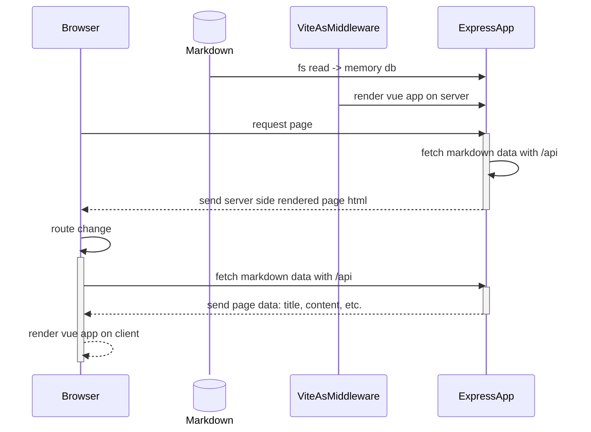

最近突然想把网站改一改，一看都有两年多没更新，也太鸽了......

趁着改版，写一篇记录一下这一历史进程。

<!-- more -->

<!--  -->

## 缘由

其实这一次改版我是想尽可能用现成的东西，毕竟开源维护的系统、界面设计都会比之前自己组装的好，也省心一点。

加上我想坚持使用 Vue，于是就想到了 [Vitepress](https://vitepress.dev/zh/)。但在 Vitepress 里想实现博客分页功能时，发现没有较好的方式，只能通过[数据加载](https://vitepress.dev/zh/guide/data-loading)来实现，而这实际上会一次性加载所有文章的元数据，实际上是在前端做假分页。对于这个点我的强迫症莫名地强烈 ~~（虽然全量加载我也没多少数据）~~，因此放弃了 Vitepress。

考虑了一下，即使还有一些其他优秀的博客系统，但最终还是决定自己主导实现，毕竟我想要的功能并不复杂，也能借此学习实践一些新的东西。

## 原理

不过与以往不同，这次尽可能使用现成的库和工具，减少自己的工作量，实现思路也将不同。新旧版核心逃不过 SSR 的思想，但旧版整体采用 Vue App（壳）+ Json Data（数据）的思路：

而新版则是会把文章数据打包在 JS 中，在 router 中枚举注册所有的页面：
