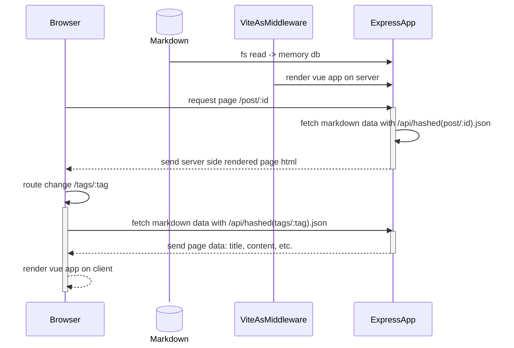
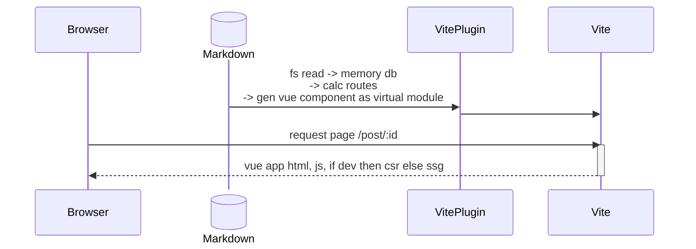

最近突然想把网站改一改，一看都有两年多没更新，也太鸽了......

趁着改版，写一篇记录一下这一历史进程。

<!-- more -->

## 缘由

其实这一次改版我是想尽可能用现成的东西，毕竟开源维护的系统、界面设计都会比之前自己组装的好，也省心一点。

加上我想坚持使用 Vue，于是就想到了 [Vitepress](https://vitepress.dev/zh/)。但在 Vitepress 里只能通过[数据加载](https://vitepress.dev/zh/guide/data-loading)来实现博客分页功能时，而这实际上会一次性加载所有文章的元数据，实际上是在前端做假分页。对于这个点我的强迫症莫名地强烈 ~~（虽然全量加载我也没多少数据）~~，因此放弃了 Vitepress。

考虑了一下，即使还有一些其他优秀的博客系统，但最终还是决定自己主导实现，毕竟我想要的功能并不复杂，也能借此学习实践一些新的东西。

## 原理

先大概画下旧版的逻辑，整体采用 Vue App（壳）+ Fetch Json Data（数据）的思路，取动态路由的参数，匹配相应的数据 Data，结合后即单个页面的渲染：

而新版的一个改变，是尽可能使用现成的库和工具，减少自己的工作量，所以整体逻辑包装成了一个 Vite Plugin，再借助 Vite SSG，免去了自行实现 server、ssg 的工作，将来升级换代的工作也少了（自己做得少、适配的工作也就少了）。

实现思路也不同，把 Markdown 解析后的内容转换为 Vue 组件、最终打包进 JS，不再使用动态路由，而是枚举注册所有的页面路由，通过路由懒加载实现数据拆分。这样做还带来了一些其他好处：

- 直接就能使用 Vite 的热更新，文章编辑实时预览
- Markdown 内可编写 Vue 代码、使用 Vue 组件

最终 ssg build 时依次渲染所有路由，生成静态页面，结束。

## 主题

缺乏设计能力，所以样式方面整体抄了 [AstroPaper](https://astro-paper.pages.dev/)，也同时借助了 [Astro Theme Pure](https://astro-pure.js.org/) 的部分元素。

## 功能

具备了 Markdown 转 Vue 的能力后，可以更容易实现一些有趣的功能了。之前做过的卡片链接也不需要去手动写 HTML 了，可以直接把 Markdown 的链接转换为内置的 `ALink` 组件，用组件来做灵活的形态变换就更简单优雅了。

后续也会参考 Vitepress，实现一些自定义的 Markdown 语法扩展。但会考虑尽可能保持简洁通用，以免后续迁移系统、导致这些方言语法无法被支持。

## 结语

目前还有一些功能没迁移完，但无伤大雅，先发一版了，后续再慢慢完善吧。顺带一提，迁移之后，把“分类”去掉了，只使用标签来组织文章，两者共存有点重复了。

最后截图留念一下旧版界面：

