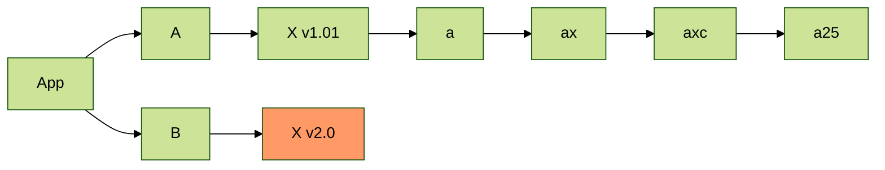

1213

123123123

<!-- more -->

ssssss




```ts
interface Loclas {
  page: {
    title: string;
    date: Moment;
    comments: boolean;
    raw: string;
    updated: Moment;

    // aaa/bbb/cccc.html
    path: string;
    // aaa/bbb/cccc/
    current_url?: string;

    // layout | page |
    layout: string;
    // html string
    content: string;
    site: { data: {} };
    // 摘要
    excerpt: string;
    // 文章 more 部分
    more: string;
    // https://xx.com/a/x.html
    permalink: string;
    // xx.md
    source: string;
    // local md path
    full_source: string;
    lang: string;
    // xx.html
    canonical_path: string;

    _id: string;
    // html string
    _content: string;
    __page: boolean;
  };
  /**
   * hexo 项目 config
   */
  config: {
    title: string;
    subtitle: string;
    description: string;
    author: string;
    language: string;
    timezone: string;
    url: string;
    root: string;
    [k: string]: any;
  };
  // page/2/index.html
  path: string;
  // 主题配置
  theme: any;
}
```

# 1

## 1-1

### 1-1-1

## 1-2

# 2

## 2-1

## 2-2
