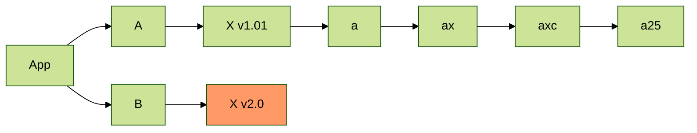

1213

123123123

<!-- more -->

ssssss



```ts
// keys of `locals`
type IKeys =
  | 'page' // 页面信息
  | 'path' // 路径
  | 'url' // 完整 url
  | 'config' // hexo 配置
  | 'theme' // 主题配置
  | 'layout'
  | 'env'
  | 'view_dir'
  | 'site'
  | '__'
  | '_p'
  | 'cache'
  | 'filename'
  | 'date'
  | 'date_xml'
  | 'time'
  | 'full_date'
  | 'relative_date'
  | 'time_tag'
  | 'moment'
  | 'search_form'
  | 'strip_html'
  | 'trim'
  | 'titlecase'
  | 'word_wrap'
  | 'truncate'
  | 'fragment_cache'
  | 'gravatar'
  | 'is_current'
  | 'is_home'
  | 'is_post'
  | 'is_page'
  | 'is_archive'
  | 'is_year'
  | 'is_month'
  | 'is_category'
  | 'is_tag'
  | 'list_archives'
  | 'list_categories'
  | 'list_tags'
  | 'list_posts'
  | 'meta_generator'
  | 'open_graph'
  | 'number_format'
  | 'paginator'
  | 'partial'
  | 'markdown'
  | 'render'
  | 'css'
  | 'js'
  | 'link_to'
  | 'mail_to'
  | 'image_tag'
  | 'favicon_tag'
  | 'feed_tag'
  | 'tagcloud'
  | 'tag_cloud'
  | 'toc'
  | 'relative_url'
  | 'url_for'
  | 'full_url_for'
  | 'inspect'
  | 'log'
  | 'min2read'
  | 'wordcount'
  | 'totalcount'
  | 'def_tagcloud';
```

```ts
interface Loclas {
  page: {
    title: string;
    date: Moment;
    comments: boolean;
    raw: string;
    updated: Moment;

    // aaa/bbb/cccc.html
    path: string;
    // aaa/bbb/cccc/
    current_url?: string;

    // layout | page |
    layout: string;
    // html string
    content: string;
    site: { data: {} };
    // 摘要
    excerpt: string;
    // 文章 more 部分
    more: string;
    // https://xx.com/a/x.html
    permalink: string;
    // xx.md
    source: string;
    // local md path
    full_source: string;
    lang: string;
    // xx.html
    canonical_path: string;

    _id: string;
    // html string
    _content: string;
    __page: boolean;
  };
  /**
   * hexo 项目 config
   */
  config: {
    title: string;
    subtitle: string;
    description: string;
    author: string;
    language: string;
    timezone: string;
    url: string;
    root: string;
    [k: string]: any;
  };
  // page/2/index.html
  path: string;
  // 主题配置
  theme: any;
}
```

# 1

## 1-1

### 1-1-1

## 1-2

# 2

## 2-1

## 2-2
